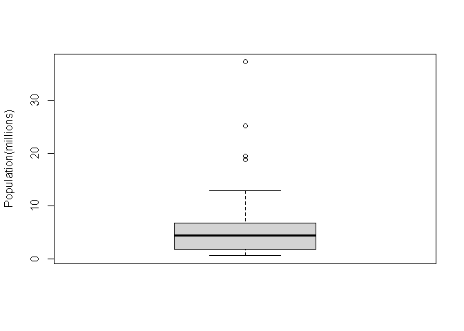
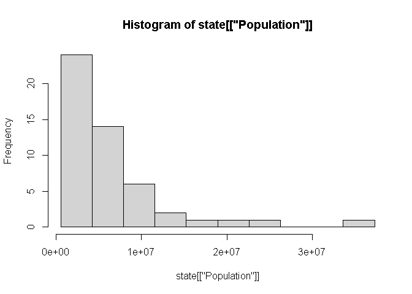
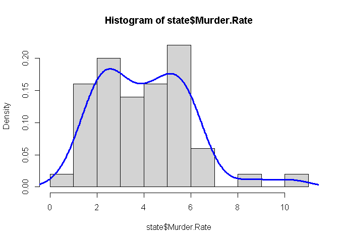
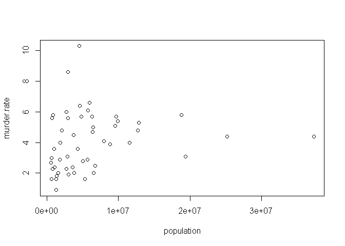
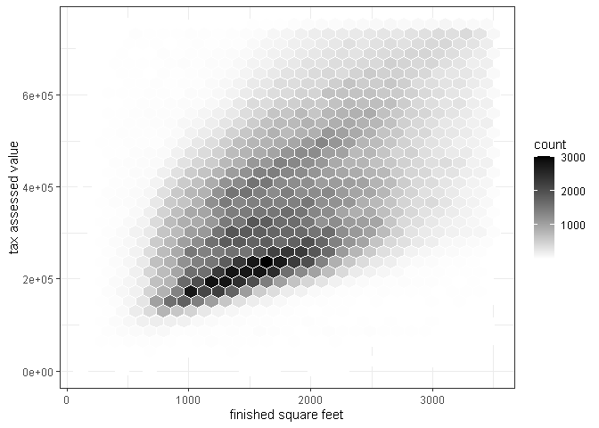
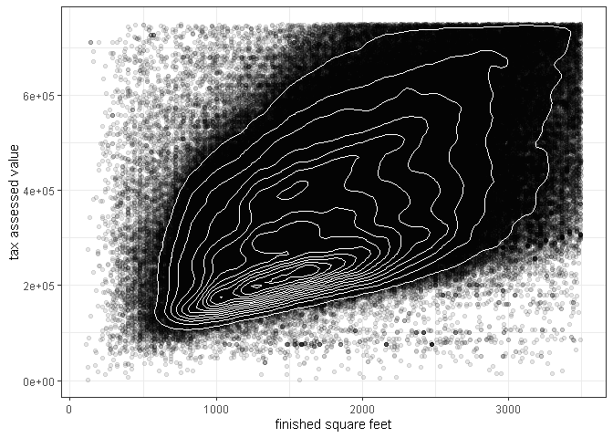
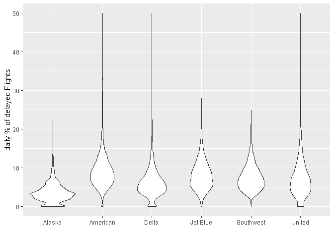
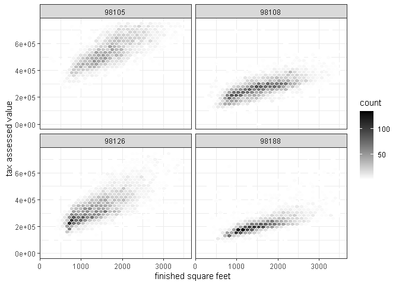

데이터과학을 위한 통계 1장
================

# 기초설정

``` r
library(tidyverse)
```

    ## -- Attaching packages --------------------------------------- tidyverse 1.3.0 --

    ## √ ggplot2 3.3.2     √ purrr   0.3.4
    ## √ tibble  3.0.4     √ dplyr   1.0.2
    ## √ tidyr   1.1.2     √ stringr 1.4.0
    ## √ readr   1.4.0     √ forcats 0.5.0

    ## -- Conflicts ------------------------------------------ tidyverse_conflicts() --
    ## x dplyr::filter() masks stats::filter()
    ## x dplyr::lag()    masks stats::lag()

# 1\. 데이터 탐색하기

``` r
state <- read_csv(file = "C:\\Users\\rkdal\\OneDrive\\바탕 화면\\월간R프로젝트\\데이터과학을위한통계\\psds_data\\state.csv")
```

    ## 
    ## -- Column specification --------------------------------------------------------
    ## cols(
    ##   State = col_character(),
    ##   Population = col_double(),
    ##   Murder.Rate = col_double(),
    ##   Abbreviation = col_character()
    ## )

``` r
# 평균 / 절사평균 / 중간값
mean(state[["Population"]])
```

    ## [1] 6162876

``` r
mean(state[["Population"]], trim=0.1)
```

    ## [1] 4783697

``` r
median(state[["Population"]])
```

    ## [1] 4436370

``` r
# 가중평균, 가중 중간값
library(matrixStats)
```

    ## 
    ## Attaching package: 'matrixStats'

    ## The following object is masked from 'package:dplyr':
    ## 
    ##     count

``` r
weighted.mean(state[["Murder.Rate"]], w = state[["Population"]])
```

    ## [1] 4.445834

``` r
weightedMedian(state[["Murder.Rate"]], w = state[["Population"]])
```

    ## [1] 4.4

``` r
# 표준편차, 사분위범위, 중위절대편차
sd(state[["Population"]])
```

    ## [1] 6848235

``` r
IQR(state[["Population"]])
```

    ## [1] 4847308

``` r
mad(state[["Population"]])
```

    ## [1] 3849870

``` r
# 백분위수 확인하기
quantile(state[["Population"]], p = c(.05, .25, .5, .75, .95))
```

    ##       5%      25%      50%      75%      95% 
    ##   689529  1833004  4436370  6680312 19118546

``` r
boxplot(state[["Population"]]/1000000, ylab="Population(millions)")
```

<!-- -->

``` r
# 도수분포표 확인하기
breaks <- seq(from = min(state[["Population"]]), 
              to = max(state[["Population"]]),
              length = 11)

pop_freq <- cut(state[["Population"]], breaks = breaks,
                right = TRUE, include.lowest = TRUE)

table(pop_freq)
```

    ## pop_freq
    ## [5.64e+05,4.23e+06]  (4.23e+06,7.9e+06]  (7.9e+06,1.16e+07] (1.16e+07,1.52e+07] 
    ##                  24                  14                   6                   2 
    ## (1.52e+07,1.89e+07] (1.89e+07,2.26e+07] (2.26e+07,2.62e+07] (2.62e+07,2.99e+07] 
    ##                   1                   1                   1                   0 
    ## (2.99e+07,3.36e+07] (3.36e+07,3.73e+07] 
    ##                   0                   1

``` r
# 히스토그램으로 확인하기
hist(state[["Population"]], breaks = breaks)
```

<!-- -->

``` r
# 밀도추정
hist(state$Murder.Rate, freq = FALSE)
lines(density(state$Murder.Rate), lwd=3, col="blue")
```

<!-- -->

# 2\. 상관관계 및 두 개 이상의 변수 탐색하기

``` r
# 산점도 그려보기
plot(state$Population, state$Murder.Rate, xlab = "population", ylab = "murder.rate")
```

<!-- -->

``` r
# kc_tax 데이터
kc_tax <- read_csv(file = "C:\\Users\\rkdal\\OneDrive\\바탕 화면\\월간R프로젝트\\데이터과학을위한통계\\psds_data\\kc_tax.csv")
```

    ## 
    ## -- Column specification --------------------------------------------------------
    ## cols(
    ##   TaxAssessedValue = col_double(),
    ##   SqFtTotLiving = col_double(),
    ##   ZipCode = col_double()
    ## )

``` r
# subset을 이용하여 필요한 부분만 남김.
kc_tax0 <- subset(kc_tax, TaxAssessedValue < 750000 & SqFtTotLiving > 100 &
                    SqFtTotLiving < 3500)

# 길이 확인하기
nrow(kc_tax0)
```

    ## [1] 432693

``` r
# 육각형 그림 : 수치형 - 수치형
ggplot(kc_tax0, mapping = aes(x = SqFtTotLiving, y = TaxAssessedValue)) +
  stat_binhex(colour = "white") +
  theme_bw() +
  scale_fill_gradient(low = "white", high = "black") +
  labs(x = "finished square feet", y = "tax assessed value")
```

<!-- -->

``` r
# 등고선 그림 : 수치형 - 수치형
ggplot(kc_tax0, mapping = aes(x = SqFtTotLiving, y = TaxAssessedValue)) +
  theme_bw() +
  geom_point(alpha = 0.1) +
  geom_density2d(colour="white") + 
  labs(x = "finished square feet", y = "tax assessed value")
```

<!-- -->

``` r
# 분할표 : 범주형 - 범주형
library(descr)
lc_loans <- read_csv(file = "C:\\Users\\rkdal\\OneDrive\\바탕 화면\\월간R프로젝트\\데이터과학을위한통계\\psds_data\\lc_loans.csv")
```

    ## 
    ## -- Column specification --------------------------------------------------------
    ## cols(
    ##   status = col_character(),
    ##   grade = col_character()
    ## )

``` r
x_tab <- CrossTable(lc_loans$grade, lc_loans$status,
                    prop.c = FALSE, prop.chisq = FALSE, prop.t = FALSE)


x_tab # 분할표 출력... 오 신기하다.
```

    ##    Cell Contents 
    ## |-------------------------|
    ## |                       N | 
    ## |           N / Row Total | 
    ## |-------------------------|
    ## 
    ## =====================================================================
    ##                   lc_loans$status
    ## lc_loans$grade    Charged Off   Current   Fully Paid    Late    Total
    ## ---------------------------------------------------------------------
    ## A                        1562     50051        20408     469    72490
    ##                         0.022     0.690        0.282   0.006    0.161
    ## ---------------------------------------------------------------------
    ## B                        5302     93852        31160    2056   132370
    ##                         0.040     0.709        0.235   0.016    0.294
    ## ---------------------------------------------------------------------
    ## C                        6023     88928        23147    2777   120875
    ##                         0.050     0.736        0.191   0.023    0.268
    ## ---------------------------------------------------------------------
    ## D                        5007     53281        13681    2308    74277
    ##                         0.067     0.717        0.184   0.031    0.165
    ## ---------------------------------------------------------------------
    ## E                        2842     24639         5949    1374    34804
    ##                         0.082     0.708        0.171   0.039    0.077
    ## ---------------------------------------------------------------------
    ## F                        1526      8444         2328     606    12904
    ##                         0.118     0.654        0.180   0.047    0.029
    ## ---------------------------------------------------------------------
    ## G                         409      1990          643     199     3241
    ##                         0.126     0.614        0.198   0.061    0.007
    ## ---------------------------------------------------------------------
    ## Total                   22671    321185        97316    9789   450961
    ## =====================================================================

``` r
# 상자그림 : 범주형 - 수치형
boxplot(state[["Population"]]/1000000, ylab="Population(millions)")
```

<!-- -->

``` r
# 바이올린 도표 : 범주형 - 수치형
airline_stats <- read_csv(file = "C:\\Users\\rkdal\\OneDrive\\바탕 화면\\월간R프로젝트\\데이터과학을위한통계\\psds_data\\airline_stats.csv")
```

    ## 
    ## -- Column specification --------------------------------------------------------
    ## cols(
    ##   pct_carrier_delay = col_double(),
    ##   pct_atc_delay = col_double(),
    ##   pct_weather_delay = col_double(),
    ##   airline = col_character()
    ## )

``` r
ggplot(data = airline_stats, mapping = aes(x = airline, y = pct_carrier_delay)) +
  ylim(0, 50) +
  geom_violin() +
  labs(x = "", y = "daily % of delayed Flights")
```

    ## Warning: Removed 38 rows containing non-finite values (stat_ydensity).

<!-- -->

``` r
# 다변수 시각화
# 조건화 변수 facet을 활용하여 여러 변수를 비교하는 용도.
ggplot(subset(kc_tax0, ZipCode %in% c(98188, 98105, 98108, 98126)), 
       mapping = aes(x = SqFtTotLiving, y = TaxAssessedValue)) +
  stat_binhex(colour = "white") +
  theme_bw() +
  scale_fill_gradient(low = "white", high = "black") +
  labs(x = "finished square feet", y = "tax assessed value") +
  facet_wrap("ZipCode")
```

<!-- -->
