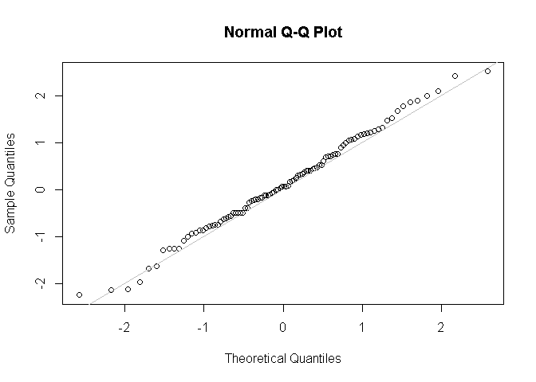
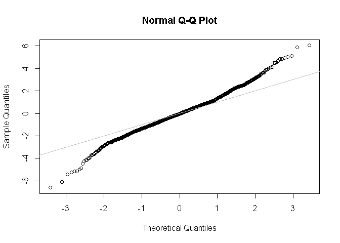

데이터과학을 위한 통계 2장
================

# 기초설정

``` r
library(tidyverse)
```

    ## -- Attaching packages --------------------------------------- tidyverse 1.3.0 --

    ## √ ggplot2 3.3.2     √ purrr   0.3.4
    ## √ tibble  3.0.4     √ dplyr   1.0.2
    ## √ tidyr   1.1.2     √ stringr 1.4.0
    ## √ readr   1.4.0     √ forcats 0.5.0

    ## -- Conflicts ------------------------------------------ tidyverse_conflicts() --
    ## x dplyr::filter() masks stats::filter()
    ## x dplyr::lag()    masks stats::lag()

# 1\. 부트스트랩

``` r
# rep 함수
head(rep(1:1000, rep(5, 1000)), n = 50) # 1~1000까지의 각 숫자를 5번씩 반복해서 총 5000번 반복
```

    ##  [1]  1  1  1  1  1  2  2  2  2  2  3  3  3  3  3  4  4  4  4  4  5  5  5  5  5
    ## [26]  6  6  6  6  6  7  7  7  7  7  8  8  8  8  8  9  9  9  9  9 10 10 10 10 10

``` r
head(rep(5, 1000), n = 50) # 5를 1000번 반복
```

    ##  [1] 5 5 5 5 5 5 5 5 5 5 5 5 5 5 5 5 5 5 5 5 5 5 5 5 5 5 5 5 5 5 5 5 5 5 5 5 5 5
    ## [39] 5 5 5 5 5 5 5 5 5 5 5 5

``` r
# 부트스트랩 표본 추출 : 복원 추출 후, 통계량과 모델을 다시 계산
library(boot)
loans_income <- read_csv(file = "C:\\Users\\rkdal\\OneDrive\\바탕 화면\\월간R프로젝트\\데이터과학을위한통계\\psds_data\\loans_income.csv")
```

    ## 
    ## -- Column specification --------------------------------------------------------
    ## cols(
    ##   x = col_double()
    ## )

``` r
stat_fun <- function(x, idx) median(x[idx])

# 인덱스 idx로 지정된 표본의 중앙값을 계산한다.
boot_obj <- boot(loans_income$x, R=1000, statistic=stat_fun)
summary(boot_obj$t)
```

    ##        V1       
    ##  Min.   :61000  
    ##  1st Qu.:62000  
    ##  Median :62000  
    ##  Mean   :61915  
    ##  3rd Qu.:62000  
    ##  Max.   :62400

부트스트랩의 경우 표본크기가 작은 것을 보완하기 위한 것이 아니다. 새 데이터를 만드는 것도 아니며, 기존 데이터 집합의 빈 곳을
채우는 것도 아니다. 모집단에서 추가적으로 표본을 뽑는다고 할 때, 그 표본이 얼마나 원래 표본과 비슷할지를 알려줄 뿐이다.

# 2\. 표본정규분포와 QQ그림

**QQ그림**은 표본이 정규분포에 얼마나 가까운지를 시각적으로 판별하는 데 사용한다. Z 점수를 오름차순으로 정렬하고 각 값의
Z 점수를 y축에 표시한다. x축은 정규분포에서의 해당 분위수를 나타낸다.

점들이 대각선에 가깝게 따라갈수록 표본분포가 정규분포에 가까운 것이다.

``` r
norm_samp <- rnorm(100)
qqnorm(norm_samp)
abline(a=0, b=1, col="grey")
```

<!-- -->

# 3\. 긴 꼬리 분포

``` r
sp500_data <- read_csv(file = "C:\\Users\\rkdal\\OneDrive\\바탕 화면\\월간R프로젝트\\데이터과학을위한통계\\psds_data\\sp500_data.csv")
```

    ## Warning: Missing column names filled in: 'X1' [1]

    ## 
    ## -- Column specification --------------------------------------------------------
    ## cols(
    ##   .default = col_double(),
    ##   X1 = col_date(format = "")
    ## )
    ## i Use `spec()` for the full column specifications.

``` r
nflx <- sp500_data$NFLX
nflx <- diff(log(nflx[nflx>0]))
qqnorm(nflx)
abline(a=0, b=1, col="grey")
```

<!-- -->

# 4\. 이항분포

``` r
# dbinom 함수는 이항 확률을 계산할 때 사용한다.
dbinom(x=2, size=5, prob=0.1)
```

    ## [1] 0.0729

``` r
# 누적 이항분포 : 2번 이하의 성공을 관찰할 확률
pbinom(2, 5, 0.1)
```

    ## [1] 0.99144

# 5\. 푸아송 분포, 그외 분포

``` r
# 포아송분포를 따르는 난수 생성
rpois(100, lambda = 2)
```

    ##   [1] 1 4 2 1 1 0 2 4 2 3 1 0 3 1 1 2 0 1 4 5 2 4 0 2 3 1 0 4 1 3 2 1 3 1 1 4 4
    ##  [38] 3 4 2 3 0 2 4 3 2 2 4 4 1 1 1 3 2 7 1 3 4 1 2 4 1 1 2 4 1 1 0 1 2 2 5 2 0
    ##  [75] 4 1 4 0 1 0 0 3 3 1 4 3 4 0 2 2 1 5 4 2 0 4 3 2 1 2

``` r
# 지수분포를 따르는 난수 생성
rexp(n=100, rate=.2)
```

    ##   [1]  3.64317345  1.07672413  4.16393896 10.21760333 30.92242114  4.63892196
    ##   [7]  8.70264095  1.99734722  3.18616422  6.02105381  8.09597910  1.46061405
    ##  [13]  0.79941680  7.94760641 21.89000741  1.15384465  1.21750839  0.39254636
    ##  [19]  2.83325331  9.44903905  5.74348195  0.81505924  2.65124684  1.98670712
    ##  [25]  0.87915129  2.14441379  4.29724613  2.40230731 20.08304815  5.91115486
    ##  [31]  0.19746167  3.43347931  0.64679234  1.35800682  2.41310519  4.85315817
    ##  [37]  0.89467397  9.87136770  0.09999196  2.11087860  0.30659127 11.05822221
    ##  [43]  5.27004770  0.51661183  6.58393674  0.44093955  0.15669835  4.69752146
    ##  [49]  0.92963056  2.94598789  2.60490143  0.37791267  3.53523185  4.85718501
    ##  [55]  8.17529448  0.23134033  2.04419041  4.88175644  2.96891651  1.59323022
    ##  [61]  5.41054309  5.58366738  0.35049757  4.31471506 15.80864796  4.44327111
    ##  [67]  0.21656806  3.55578898 11.11401011  0.40108716  2.64217577  9.31684104
    ##  [73]  0.66536858  2.84454609  0.18755497  1.81490372 10.69830642  1.81579651
    ##  [79]  6.82500516  1.75761937  2.17205766  5.33664060  8.29475998  1.24042113
    ##  [85]  0.73851175  4.59982606  6.04566649  0.04380233  0.06485070  3.97934816
    ##  [91]  0.43896614  0.13097422  2.37670871  0.40276805  0.51056682  5.31108736
    ##  [97]  3.45577564  2.26714323  1.46325306 16.63468615
