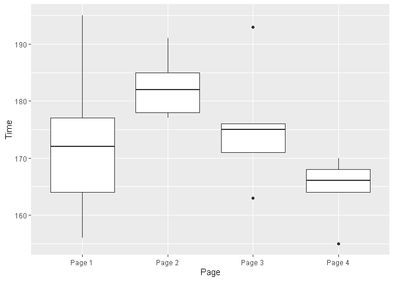

데이터과학을 위한 통계 3장
================

# 기초설정

``` r
library(tidyverse)
```

    ## -- Attaching packages --------------------------------------- tidyverse 1.3.0 --

    ## √ ggplot2 3.3.2     √ purrr   0.3.4
    ## √ tibble  3.0.4     √ dplyr   1.0.2
    ## √ tidyr   1.1.2     √ stringr 1.4.0
    ## √ readr   1.4.0     √ forcats 0.5.0

    ## -- Conflicts ------------------------------------------ tidyverse_conflicts() --
    ## x dplyr::filter() masks stats::filter()
    ## x dplyr::lag()    masks stats::lag()

# 1\. 임의 순열검정

그룹들에 적용된 처리의 결과를 하나로 합친다. 이것은 그룹들에 적용된 처리의 결과가 다르지 않다는 귀무가설을 논리적으로 구체화한
것이다. 그런 다음 결합된 집합에서 무작위로 그룹을 뽑아 그 가설을 검정하고 서로 얼마나 다른지 살핀다.

``` r
# 1. 임의 순열검정 진행 
web_page_data <- read_csv(file = "C:\\Users\\rkdal\\OneDrive\\바탕 화면\\월간R프로젝트\\데이터과학을위한통계\\psds_data\\web_page_data.csv")
```

    ## 
    ## -- Column specification --------------------------------------------------------
    ## cols(
    ##   Page = col_character(),
    ##   Time = col_double()
    ## )

``` r
web_page_data <- as.data.frame(web_page_data)

mean_a <- 1.263
mean_b <- 1.620

# n2개의 표본을 추출하고, 그룹B에 할당. 나머지 n1개는 그룹 a에 할당. 두 평균 차이 반환
perm_fun <- function(x, n1, n2){
  
  n <- n1+n2
  idx_b <- sample(1:n, n1)
  idx_a <- setdiff(1:n, idx_b)
  mean_diff <- mean(x[idx_b])-mean(x[idx_a])
  return(mean_diff)
  
}

perm_diffs <- rep(0, 1000)

for (i in 1:1000) {
  
  perm_diffs[i] <- perm_fun(web_page_data$Time, 21, 15)
  
}

hist(perm_diffs)
abline(v = mean_b - mean_a)
```

<!-- -->

히스토그램을 통해, 무작위 순열로 구한 평균 세션 시간의 차이가 가끔 실제 관찰된 세션 시간의 차이(수직선)를 넘어가는 것을 볼
수 있다. 이는 페이지 A와B 사이의 세션 시간의 차이가 확률분포의 범위 내에 있음을 의미하고, 따라서 차이는 통계적으로
유의하지 않다.

# 2\. p값 테스트

|   결과    | 가격 A  | 가격 B  |
| :-----: | :---: | :---: |
|   전환    |  200  |  182  |
| 전환되지 않음 | 23539 | 22406 |

``` r
# A가 B보다 5%더 우수한 결과를 얻었다고 할 때, p값을 확인할 수 있다.
# 인수 x는 각 그룹의 성공 횟수, 인수 n은 시행 횟수.
prop.test(x=c(200, 182), n=c(23739, 22588), alternative = "greater")
```

    ## 
    ##  2-sample test for equality of proportions with continuity correction
    ## 
    ## data:  c(200, 182) out of c(23739, 22588)
    ## X-squared = 0.14893, df = 1, p-value = 0.3498
    ## alternative hypothesis: greater
    ## 95 percent confidence interval:
    ##  -0.001057439  1.000000000
    ## sample estimates:
    ##      prop 1      prop 2 
    ## 0.008424955 0.008057376

# 3\. t 검정

``` r
# 대립가설 : A페이지에 대한 평균 세션 시간이 B에 대한 평균보다 작다.
t.test(Time ~ Page, data = web_page_data, alternative = "less")
```

    ## 
    ##  Welch Two Sample t-test
    ## 
    ## data:  Time by Page
    ## t = -1.0983, df = 27.693, p-value = 0.1408
    ## alternative hypothesis: true difference in means is less than 0
    ## 95 percent confidence interval:
    ##       -Inf 0.1959674
    ## sample estimates:
    ## mean in group Page A mean in group Page B 
    ##             1.263333             1.620000

# 4\. 분산분석(ANOVA)

자세한 이론적 설명은 생략하기로 하고, 함수 정리, 예제에 집중하고자 한다.

``` r
four_sessions <- read_csv(file = "C:\\Users\\rkdal\\OneDrive\\바탕 화면\\월간R프로젝트\\데이터과학을위한통계\\psds_data\\four_sessions.csv")
```

    ## 
    ## -- Column specification --------------------------------------------------------
    ## cols(
    ##   Page = col_character(),
    ##   Time = col_double()
    ## )

``` r
four_sessions <- as.data.frame(four_sessions)

# 4가지 페이지의 boxplot 확인
ggplot(data = four_sessions, mapping = aes(x = Page, y = Time)) +
  geom_boxplot()
```

<!-- -->

``` r
# ANOVA 재표본추출 순열검정 함수 : aovp. F검정이 아닌, 순열검정을 통해 p값 산출
library(lmPerm)
summary(aovp(Time ~ Page, data = four_sessions))
```

    ## [1] "Settings:  unique SS "

    ## Component 1 :
    ##             Df R Sum Sq R Mean Sq Iter Pr(Prob)  
    ## Page1        3    831.4    277.13 5000   0.0692 .
    ## Residuals   16   1618.4    101.15                
    ## ---
    ## Signif. codes:  0 '***' 0.001 '**' 0.01 '*' 0.05 '.' 0.1 ' ' 1

``` r
# F통계랑을 기반으로 한 ANOVA 통계 검정
summary(aov(Time ~ Page, data = four_sessions))
```

    ##             Df Sum Sq Mean Sq F value Pr(>F)  
    ## Page         3  831.4   277.1    2.74 0.0776 .
    ## Residuals   16 1618.4   101.2                 
    ## ---
    ## Signif. codes:  0 '***' 0.001 '**' 0.01 '*' 0.05 '.' 0.1 ' ' 1

#### aovp

1.  모든 데이터를 한 상자에 모은다.

2.  5개의 값을 갖는 4개의 재표본을 섞어서 추출한다.

3.  각 그룹의 평균을 기록한다.

4.  네 그룹 평균 사이의 분산을 기록한다.

5.  2\~4 단계를 여러 번 반복한다.(예를 들면 1000번)

재표집된 분산이 관찰된 변화를 초과한 경우가 p값이 됨.
