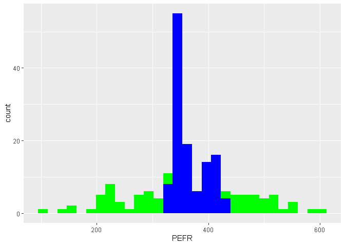

데이터과학을 위한 통계 4장
================

# 기초설정

``` r
library(tidyverse)
```

    ## -- Attaching packages --------------------------------------- tidyverse 1.3.0 --

    ## √ ggplot2 3.3.2     √ purrr   0.3.4
    ## √ tibble  3.0.4     √ dplyr   1.0.2
    ## √ tidyr   1.1.2     √ stringr 1.4.0
    ## √ readr   1.4.0     √ forcats 0.5.0

    ## -- Conflicts ------------------------------------------ tidyverse_conflicts() --
    ## x dplyr::filter() masks stats::filter()
    ## x dplyr::lag()    masks stats::lag()

# 1\. 단순선형회귀

``` r
lung <- read_csv(file = "C:\\Users\\rkdal\\OneDrive\\바탕 화면\\월간R프로젝트\\데이터과학을위한통계\\psds_data\\LungDisease.csv")
```

    ## 
    ## -- Column specification --------------------------------------------------------
    ## cols(
    ##   PEFR = col_double(),
    ##   Exposure = col_double()
    ## )

``` r
# pefr : 폐활량, exposure : 면진 노출 연수
str(lung)
```

    ## tibble [122 x 2] (S3: spec_tbl_df/tbl_df/tbl/data.frame)
    ##  $ PEFR    : num [1:122] 390 410 430 460 420 280 420 520 610 590 ...
    ##  $ Exposure: num [1:122] 0 0 0 0 1 2 2 2 3 3 ...
    ##  - attr(*, "spec")=
    ##   .. cols(
    ##   ..   PEFR = col_double(),
    ##   ..   Exposure = col_double()
    ##   .. )

``` r
# 모델 적합 후 확인
ex_model1 <- lm(PEFR ~ ., data=lung)
summary(ex_model1)
```

    ## 
    ## Call:
    ## lm(formula = PEFR ~ ., data = lung)
    ## 
    ## Residuals:
    ##      Min       1Q   Median       3Q      Max 
    ## -297.845  -58.783   -1.214   61.024  209.109 
    ## 
    ## Coefficients:
    ##             Estimate Std. Error t value Pr(>|t|)    
    ## (Intercept)  424.583     20.796  20.417  < 2e-16 ***
    ## Exposure      -4.185      1.325  -3.158  0.00201 ** 
    ## ---
    ## Signif. codes:  0 '***' 0.001 '**' 0.01 '*' 0.05 '.' 0.1 ' ' 1
    ## 
    ## Residual standard error: 101.4 on 120 degrees of freedom
    ## Multiple R-squared:  0.07674,    Adjusted R-squared:  0.06905 
    ## F-statistic: 9.974 on 1 and 120 DF,  p-value: 0.002008

``` r
# 적합값
ex_fitted <- predict(ex_model1)

# 잔차
resid <- residuals(ex_model1)

lung$pred <- ex_fitted

ggplot(data = lung) +
  geom_histogram(mapping = aes(x = PEFR),
                 fill = "green") +
  geom_histogram(mapping = aes(x = pred),
                 fill = "blue")
```

    ## `stat_bin()` using `bins = 30`. Pick better value with `binwidth`.

    ## `stat_bin()` using `bins = 30`. Pick better value with `binwidth`.

<!-- -->

# 2\. 다중선형회귀

생략

# 3\. 회귀에서의 요인변수

그냥 간편하게 diamonds 데이터를 사용하겠다.

요인변수는 범주형 변수이다. 더미변수로 만들어서 활용한다.

``` r
# diamonds 기본 토이데이터
ex_data <- diamonds

# 데이터 구조 파악하기
# 범주형 : cut, color, clarity
str(ex_data)
```

    ## tibble [53,940 x 10] (S3: tbl_df/tbl/data.frame)
    ##  $ carat  : num [1:53940] 0.23 0.21 0.23 0.29 0.31 0.24 0.24 0.26 0.22 0.23 ...
    ##  $ cut    : Ord.factor w/ 5 levels "Fair"<"Good"<..: 5 4 2 4 2 3 3 3 1 3 ...
    ##  $ color  : Ord.factor w/ 7 levels "D"<"E"<"F"<"G"<..: 2 2 2 6 7 7 6 5 2 5 ...
    ##  $ clarity: Ord.factor w/ 8 levels "I1"<"SI2"<"SI1"<..: 2 3 5 4 2 6 7 3 4 5 ...
    ##  $ depth  : num [1:53940] 61.5 59.8 56.9 62.4 63.3 62.8 62.3 61.9 65.1 59.4 ...
    ##  $ table  : num [1:53940] 55 61 65 58 58 57 57 55 61 61 ...
    ##  $ price  : int [1:53940] 326 326 327 334 335 336 336 337 337 338 ...
    ##  $ x      : num [1:53940] 3.95 3.89 4.05 4.2 4.34 3.94 3.95 4.07 3.87 4 ...
    ##  $ y      : num [1:53940] 3.98 3.84 4.07 4.23 4.35 3.96 3.98 4.11 3.78 4.05 ...
    ##  $ z      : num [1:53940] 2.43 2.31 2.31 2.63 2.75 2.48 2.47 2.53 2.49 2.39 ...

``` r
# 이진변수 만들기(원-핫 인코딩)
clarity_dummy <- model.matrix(~clarity-1, data=ex_data)
str(clarity_dummy)
```

    ##  num [1:53940, 1:8] 0 0 0 0 0 0 0 0 0 0 ...
    ##  - attr(*, "dimnames")=List of 2
    ##   ..$ : chr [1:53940] "1" "2" "3" "4" ...
    ##   ..$ : chr [1:8] "clarityI1" "claritySI2" "claritySI1" "clarityVS2" ...
    ##  - attr(*, "assign")= int [1:8] 1 1 1 1 1 1 1 1
    ##  - attr(*, "contrasts")=List of 1
    ##   ..$ clarity: chr "contr.poly"

``` r
head(clarity_dummy)
```

    ##   clarityI1 claritySI2 claritySI1 clarityVS2 clarityVS1 clarityVVS2 clarityVVS1
    ## 1         0          1          0          0          0           0           0
    ## 2         0          0          1          0          0           0           0
    ## 3         0          0          0          0          1           0           0
    ## 4         0          0          0          1          0           0           0
    ## 5         0          1          0          0          0           0           0
    ## 6         0          0          0          0          0           1           0
    ##   clarityIF
    ## 1         0
    ## 2         0
    ## 3         0
    ## 4         0
    ## 5         0
    ## 6         0

``` r
ex_lm <- lm(price ~ carat + depth + table + x + y + z, data = ex_data)

# 모델의 잔차를 사용하여 범주형 변수 축소하기
# 각 clarity에 대한 잔차의 중간값을 계산하고 ntile 함수를 사용해 중간값으로 정렬한 clarity를 3개의 그룹으로 분할한다.
ex_group <- ex_data %>% 
  mutate(resid = residuals(ex_lm)) %>%
  group_by(clarity) %>% 
  summarise(med_resid = median(resid),
            cnt = n()) %>% 
  arrange(med_resid) %>% 
  mutate(cum_cnt = cumsum(cnt),
         clarity_group = ntile(cum_cnt, 3))
```

    ## `summarise()` ungrouping output (override with `.groups` argument)

순서가 있는 범주형 범수의 경우, 수치형 변수로 처리하기도 한다. 그냥 범주형 변수로 다루면 잃어버릴 수 있는 정보를 유지하기
위함이다.

# 4\. 회귀식 해석

``` r
# 요약 정보
summary(ex_lm)
```

    ## 
    ## Call:
    ## lm(formula = price ~ carat + depth + table + x + y + z, data = ex_data)
    ## 
    ## Residuals:
    ##      Min       1Q   Median       3Q      Max 
    ## -23878.2   -615.0    -50.7    347.9  12759.2 
    ## 
    ## Coefficients:
    ##              Estimate Std. Error t value Pr(>|t|)    
    ## (Intercept) 20849.316    447.562  46.584  < 2e-16 ***
    ## carat       10686.309     63.201 169.085  < 2e-16 ***
    ## depth        -203.154      5.504 -36.910  < 2e-16 ***
    ## table        -102.446      3.084 -33.216  < 2e-16 ***
    ## x           -1315.668     43.070 -30.547  < 2e-16 ***
    ## y              66.322     25.523   2.599  0.00937 ** 
    ## z              41.628     44.305   0.940  0.34744    
    ## ---
    ## Signif. codes:  0 '***' 0.001 '**' 0.01 '*' 0.05 '.' 0.1 ' ' 1
    ## 
    ## Residual standard error: 1497 on 53933 degrees of freedom
    ## Multiple R-squared:  0.8592, Adjusted R-squared:  0.8592 
    ## F-statistic: 5.486e+04 on 6 and 53933 DF,  p-value: < 2.2e-16

``` r
# 회귀계수 정보
ex_lm$coefficients
```

    ## (Intercept)       carat       depth       table           x           y 
    ##  20849.3164  10686.3091   -203.1541   -102.4457  -1315.6678     66.3216 
    ##           z 
    ##     41.6277

``` r
# update를 활용하여 변수를 추가하거나 제외하여 평가하기
update(ex_lm, . ~ . -z)
```

    ## 
    ## Call:
    ## lm(formula = price ~ carat + depth + table + x + y, data = ex_data)
    ## 
    ## Coefficients:
    ## (Intercept)        carat        depth        table            x            y  
    ##    20702.95     10686.71      -200.72      -102.49     -1293.54        69.58

``` r
# 표준화잔차(잔차/표준오차)
sresid <- rstandard(ex_lm)

# order함수를 사용하여 가장 작은 잔차의 위치 확인. 특이값 탐색에 유용하다.
idx <- order(sresid)
sresid[idx[1]]
```

    ##    27416 
    ## -16.0175

회귀모형에서 제외됐을 때 모델에 중요한 변화를 가져오는 값을 주영향관측값이라고 한다.

회귀식에 한 레코드가 미치는 영향력의 정도를 레버리지라 하는데, 일반적으로 레버리지를 측정하는 척도는 햇 값이다. 또 다른
지표로는 쿡의 거리가 있다. 레버리지와 잔차의 크기를 합쳐서 영향력을 판단한다.

햇 값이 2(P+1)/n 이상의 값들은 레버리지가 높은 데이터 값을 나타낸다.

쿡의 거리는 4/(n-P-1)보다 크면 영향력이 높다고 보는 편이다.

``` r
# 영향력 그림
std_resid <- rstandard(ex_lm)
cooks_d <- cooks.distance(ex_lm)
hat_values <- hatvalues(ex_lm)
plot(hat_values, std_resid, cex=10*sqrt(cooks_d))
```

<!-- -->

# 5\. 다항회귀와 스플라인 회귀

다항회귀 : 회귀모형에 다항식(제곱, 세제곱 등) 항을 추가한 방식이다.

스플라인 회귀 : 다항 구간들을 부드러운 곡선 형태로 피팅한다.

매듭 : 스플라인 구간을 구분하는 값들.

일반화가법모형(gam) : 자동으로 구간을 결정하는 스플라인 모델.

비선형회귀 모델은 수치 최적화가 필요하기 때문에 피팅하기가 어렵고, 더 많은 계산을 필요로 한다. 이러한 이유로 가능하면
선형모형을 이용하는 것이 일반적이다.

``` r
# 다항회귀 : poly함수 이용할 것(carat을 2차항으로)
ex_lm2 <- lm(price ~ poly(carat, 2) + depth + table + x + y + z, data = ex_data)
summary(ex_lm2)
```

    ## 
    ## Call:
    ## lm(formula = price ~ poly(carat, 2) + depth + table + x + y + 
    ##     z, data = ex_data)
    ## 
    ## Residuals:
    ##      Min       1Q   Median       3Q      Max 
    ## -20329.7   -597.1    -26.8    367.6  12678.4 
    ## 
    ## Coefficients:
    ##                   Estimate Std. Error t value Pr(>|t|)    
    ## (Intercept)      4.299e+04  6.155e+02   69.84   <2e-16 ***
    ## poly(carat, 2)1  1.565e+06  1.343e+04  116.58   <2e-16 ***
    ## poly(carat, 2)2 -9.920e+04  2.941e+03  -33.73   <2e-16 ***
    ## depth           -2.707e+02  5.803e+00  -46.65   <2e-16 ***
    ## table           -1.148e+02  3.074e+00  -37.35   <2e-16 ***
    ## x               -2.760e+03  6.042e+01  -45.68   <2e-16 ***
    ## y                1.671e+01  2.530e+01    0.66    0.509    
    ## z               -6.573e+00  4.387e+01   -0.15    0.881    
    ## ---
    ## Signif. codes:  0 '***' 0.001 '**' 0.01 '*' 0.05 '.' 0.1 ' ' 1
    ## 
    ## Residual standard error: 1481 on 53932 degrees of freedom
    ## Multiple R-squared:  0.8621, Adjusted R-squared:  0.8621 
    ## F-statistic: 4.818e+04 on 7 and 53932 DF,  p-value: < 2.2e-16

``` r
# 스플라인 : 점들 사이를 부드럽게 보간
library(splines)

# 3차 스플라인(매듭 : .25, .5, .75 사분위)
knots <- quantile(ex_data$carat, p=c(.25, .5, .75))
lm_spline <- lm(price ~ bs(carat, knots = knots, degree = 3) + depth + table + x + y + z, data = ex_data)

summary(lm_spline)
```

    ## 
    ## Call:
    ## lm(formula = price ~ bs(carat, knots = knots, degree = 3) + depth + 
    ##     table + x + y + z, data = ex_data)
    ## 
    ## Residuals:
    ##      Min       1Q   Median       3Q      Max 
    ## -11788.4   -445.2    -44.4    311.1  14498.8 
    ## 
    ## Coefficients:
    ##                                        Estimate Std. Error t value Pr(>|t|)    
    ## (Intercept)                           16157.886    611.691  26.415  < 2e-16 ***
    ## bs(carat, knots = knots, degree = 3)1  -402.131    123.825  -3.248  0.00116 ** 
    ## bs(carat, knots = knots, degree = 3)2   843.508    118.952   7.091 1.35e-12 ***
    ## bs(carat, knots = knots, degree = 3)3  1876.389    168.373  11.144  < 2e-16 ***
    ## bs(carat, knots = knots, degree = 3)4 19420.804    383.958  50.581  < 2e-16 ***
    ## bs(carat, knots = knots, degree = 3)5 27112.794    514.790  52.668  < 2e-16 ***
    ## bs(carat, knots = knots, degree = 3)6  5333.861   1078.264   4.947 7.57e-07 ***
    ## depth                                  -149.116      5.939 -25.109  < 2e-16 ***
    ## table                                   -89.915      2.993 -30.044  < 2e-16 ***
    ## x                                      -416.653     70.880  -5.878 4.17e-09 ***
    ## y                                        96.880     24.437   3.964 7.37e-05 ***
    ## z                                        79.265     42.333   1.872  0.06116 .  
    ## ---
    ## Signif. codes:  0 '***' 0.001 '**' 0.01 '*' 0.05 '.' 0.1 ' ' 1
    ## 
    ## Residual standard error: 1429 on 53928 degrees of freedom
    ## Multiple R-squared:  0.8718, Adjusted R-squared:  0.8718 
    ## F-statistic: 3.334e+04 on 11 and 53928 DF,  p-value: < 2.2e-16

``` r
# 일반화 가법 모형 : 스플라인 회귀를 자동으로 찾는 기술
library(mgcv)
```

    ## Loading required package: nlme

    ## 
    ## Attaching package: 'nlme'

    ## The following object is masked from 'package:dplyr':
    ## 
    ##     collapse

    ## This is mgcv 1.8-33. For overview type 'help("mgcv-package")'.

``` r
lm_gam <- gam(price ~ s(carat) + depth + table + x + y + z, data = ex_data)
summary(lm_gam)
```

    ## 
    ## Family: gaussian 
    ## Link function: identity 
    ## 
    ## Formula:
    ## price ~ s(carat) + depth + table + x + y + z
    ## 
    ## Parametric coefficients:
    ##              Estimate Std. Error t value Pr(>|t|)    
    ## (Intercept) 19042.830    696.214  27.352  < 2e-16 ***
    ## depth        -145.737      5.867 -24.838  < 2e-16 ***
    ## table         -92.017      2.968 -31.001  < 2e-16 ***
    ## x            -274.407     69.557  -3.945 7.99e-05 ***
    ## y              90.160     24.208   3.724 0.000196 ***
    ## z              65.505     41.936   1.562 0.118285    
    ## ---
    ## Signif. codes:  0 '***' 0.001 '**' 0.01 '*' 0.05 '.' 0.1 ' ' 1
    ## 
    ## Approximate significance of smooth terms:
    ##            edf Ref.df    F p-value    
    ## s(carat) 8.872  8.992 4272  <2e-16 ***
    ## ---
    ## Signif. codes:  0 '***' 0.001 '**' 0.01 '*' 0.05 '.' 0.1 ' ' 1
    ## 
    ## R-sq.(adj) =  0.874   Deviance explained = 87.4%
    ## GCV = 2.0028e+06  Scale est. = 2.0023e+06  n = 53940

자세한 내용은 알아서 구글링해보기. 여기서는 이런 것도 있구나. 하는 식으로 넘어가기.
