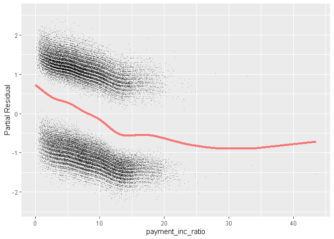

데이터과학을 위한 통계 5장
================

# 기초설정

``` r
library(tidyverse)
```

    ## -- Attaching packages --------------------------------------- tidyverse 1.3.0 --

    ## √ ggplot2 3.3.2     √ purrr   0.3.4
    ## √ tibble  3.0.4     √ dplyr   1.0.2
    ## √ tidyr   1.1.2     √ stringr 1.4.0
    ## √ readr   1.4.0     √ forcats 0.5.0

    ## -- Conflicts ------------------------------------------ tidyverse_conflicts() --
    ## x dplyr::filter() masks stats::filter()
    ## x dplyr::lag()    masks stats::lag()

이젠 데이터셋 불러오기도 귀찮아서 그냥 기본 데이터셋을 쓰려고 한다.

#### 일반적인 이진 분류 접근 방식

  - 어떤 레코드가 속할 거라고 생각되는 관심 클래스에 대한 **컷오프 확률**을 정한다.
  - 레코드가 관심 클래스에 속할 확률을 추정한다.
  - 그 확률이 컷오프 확률 이상이면 관심 클래스에 해당 레코드를 할당한다.

## 1\. 나이브 베이즈

베이지언 통계의 방법으로 간주되지 않는다. 주로 데이터 중심의 경험적 방법이다.

베이즈 규칙과 비슷한 계산이 들어가기 때문에 이름이 붙었다.

``` r
loan <- read_csv(file = "C:\\Users\\rkdal\\OneDrive\\바탕 화면\\월간R프로젝트\\데이터과학을위한통계\\psds_data\\loan_data.csv")
```

    ## Warning: Missing column names filled in: 'X1' [1]

    ## 
    ## -- Column specification --------------------------------------------------------
    ## cols(
    ##   .default = col_double(),
    ##   status = col_character(),
    ##   term = col_character(),
    ##   purpose = col_character(),
    ##   home_ownership = col_character(),
    ##   outcome = col_character(),
    ##   purpose_ = col_character(),
    ##   home_ = col_character(),
    ##   emp_len_ = col_character()
    ## )
    ## i Use `spec()` for the full column specifications.

``` r
# 데이터 간단 편집
loan <- as.data.frame(loan)

for (i in 1:ncol(loan)) {
  
  if (is.character(loan[, i])) {
    
    loan[, i] <- as.factor(loan[, i])
    
  }
  
}

# 구조확인
str(loan)
```

    ## 'data.frame':    45342 obs. of  21 variables:
    ##  $ X1               : num  1 2 3 4 5 6 7 8 9 10 ...
    ##  $ status           : Factor w/ 3 levels "Charged Off",..: 1 1 1 1 1 1 1 1 1 1 ...
    ##  $ loan_amnt        : num  2500 5600 5375 9000 10000 ...
    ##  $ term             : Factor w/ 2 levels "36 months","60 months": 2 2 2 1 1 1 1 1 2 1 ...
    ##  $ annual_inc       : num  30000 40000 15000 30000 100000 ...
    ##  $ dti              : num  1 5.55 18.08 10.08 7.06 ...
    ##  $ payment_inc_ratio: num  2.39 4.57 9.72 12.22 3.91 ...
    ##  $ revol_bal        : num  1687 5210 9279 10452 11997 ...
    ##  $ revol_util       : num  9.4 32.6 36.5 91.7 55.5 90.3 29.7 57.6 59.5 62.1 ...
    ##  $ purpose          : Factor w/ 12 levels "car","credit_card",..: 1 10 9 3 9 3 6 3 9 3 ...
    ##  $ home_ownership   : Factor w/ 4 levels "MORTGAGE","OTHER",..: 4 3 4 4 4 4 4 4 4 1 ...
    ##  $ delinq_2yrs_zero : num  1 1 1 1 1 1 1 1 0 1 ...
    ##  $ pub_rec_zero     : num  1 1 1 1 1 1 1 1 1 1 ...
    ##  $ open_acc         : num  3 11 2 4 14 7 7 7 14 17 ...
    ##  $ grade            : num  4.8 1.4 6 4.2 5.4 5.8 5.6 4.4 3.4 7 ...
    ##  $ outcome          : Factor w/ 2 levels "default","paid off": 1 1 1 1 1 1 1 1 1 1 ...
    ##  $ emp_length       : num  1 5 1 1 4 11 2 10 3 11 ...
    ##  $ purpose_         : Factor w/ 7 levels "credit_card",..: 4 7 6 2 6 2 4 2 6 2 ...
    ##  $ home_            : Factor w/ 3 levels "MORTGAGE","OWN",..: 3 2 3 3 3 3 3 3 3 1 ...
    ##  $ emp_len_         : Factor w/ 2 levels "< 1 Year","> 1 Year": 2 2 2 2 2 2 2 2 2 2 ...
    ##  $ borrower_score   : num  0.65 0.8 0.6 0.5 0.55 0.4 0.7 0.5 0.45 0.5 ...
    ##  - attr(*, "spec")=
    ##   .. cols(
    ##   ..   X1 = col_double(),
    ##   ..   status = col_character(),
    ##   ..   loan_amnt = col_double(),
    ##   ..   term = col_character(),
    ##   ..   annual_inc = col_double(),
    ##   ..   dti = col_double(),
    ##   ..   payment_inc_ratio = col_double(),
    ##   ..   revol_bal = col_double(),
    ##   ..   revol_util = col_double(),
    ##   ..   purpose = col_character(),
    ##   ..   home_ownership = col_character(),
    ##   ..   delinq_2yrs_zero = col_double(),
    ##   ..   pub_rec_zero = col_double(),
    ##   ..   open_acc = col_double(),
    ##   ..   grade = col_double(),
    ##   ..   outcome = col_character(),
    ##   ..   emp_length = col_double(),
    ##   ..   purpose_ = col_character(),
    ##   ..   home_ = col_character(),
    ##   ..   emp_len_ = col_character(),
    ##   ..   borrower_score = col_double()
    ##   .. )

``` r
# 나이브 베이즈 모델
library(klaR)
```

    ## Loading required package: MASS

    ## 
    ## Attaching package: 'MASS'

    ## The following object is masked from 'package:dplyr':
    ## 
    ##     select

``` r
naive_model <- NaiveBayes(outcome ~ purpose_ + home_ + emp_len_,
                          data = na.omit(loan))

naive_model$tables
```

    ## $purpose_
    ##           var
    ## grouping   credit_card debt_consolidation home_improvement major_purchase
    ##   default   0.15151515         0.57571347       0.05981209     0.03727229
    ##   paid off  0.18759649         0.55215915       0.07150104     0.05359270
    ##           var
    ## grouping      medical      other small_business
    ##   default  0.01433549 0.11561025     0.04574126
    ##   paid off 0.01424728 0.09990737     0.02099599
    ## 
    ## $home_
    ##           var
    ## grouping    MORTGAGE       OWN      RENT
    ##   default  0.4313440 0.0832782 0.4853778
    ##   paid off 0.4894800 0.0808963 0.4296237
    ## 
    ## $emp_len_
    ##           var
    ## grouping     < 1 Year   > 1 Year
    ##   default  0.04728508 0.95271492
    ##   paid off 0.03105289 0.96894711

모델로부터 나온 결과는 각각 조건부확률이다.

모델을 통해 새로운 대출에 대한 결과를 예측할 수 있다.

확률의 비편향된 추정치를 굳이 구할 필요가 없다면, 나이브 베이즈도 나름 우수한 결과를 보인다.

**수치형 변수**를 예측하기 위해서는, 두 가지 접근법 중 하나를 고려한다.

  - 수치형 예측변수를 비닝(binning)하여 범주형으로 변환 후, 알고리즘을 적용
  - 조건부 확률을 추정하기 위해 정규분포 같은 확률모형을 사용.

<!-- end list -->

``` r
# 나이브 베이즈 모델을 통한 예측
predict(naive_model, loan[1:10, c("purpose_", "home_", "emp_len_")])
```

    ## $class
    ##        1        2        3        4        5        6        7        8 
    ## paid off  default  default  default  default  default paid off  default 
    ##        9       10 
    ##  default paid off 
    ## Levels: default paid off
    ## 
    ## $posterior
    ##      default  paid off
    ## 1  0.4358457 0.5641543
    ## 2  0.6880017 0.3119983
    ## 3  0.5624484 0.4375516
    ## 4  0.5366584 0.4633416
    ## 5  0.5624484 0.4375516
    ## 6  0.5366584 0.4633416
    ## 7  0.4358457 0.5641543
    ## 8  0.5366584 0.4633416
    ## 9  0.5624484 0.4375516
    ## 10 0.4746323 0.5253677

## 2\. 판별분석

초창기 통계 분류 방법이다. 선형판별분석(LDA)가 일반적으로 사용된다. 트리 모델이나 로지스틱 회귀와 같은 더 정교한 기법이
출현한 후 많이 사용하지 않는다.

하지만 주성분분석과 같이, 아직도 많이 사용되는 방법들과 연결된다. 예측변수들의 중요성을 측정하거나 효과적으로 특징을 선택하는
방법 등으로도 사용될 수 있다.

자세한 원리는 책 및 구글링 참고

``` r
library(MASS)

# 두 변수로 판별분석 적용
loan_lda <- lda(outcome ~ borrower_score + payment_inc_ratio,
                data = loan)

# 선형판별자 가중치
loan_lda$scaling
```

    ##                          LD1
    ## borrower_score     6.8621784
    ## payment_inc_ratio -0.1148159

``` r
# 예측치
pred <- predict(loan_lda)
head(pred$posterior)
```

    ##     default  paid off
    ## 1 0.2474680 0.7525320
    ## 2 0.1642565 0.8357435
    ## 3 0.4182154 0.5817846
    ## 4 0.5775583 0.4224417
    ## 5 0.3672816 0.6327184
    ## 6 0.6101300 0.3898700

## 3\. 로지스틱 회귀

로지스틱 회귀는 선형회귀를 확장한 **일반화선형모형(GLM)의 특별한 사례**이다.

로지스틱 회귀에서는 최대우도추정법(MLE)을 사용하여 모델을 피팅한다.

R에서 로지스틱 회귀를 구하려면 family 인수를 binomial로 지정하고 glm 함수를 사용한다.

``` r
# glm 함수를 이용하여 로지스틱 회귀 모형 만들기
logistic_model1 <- glm(outcome ~ payment_inc_ratio + purpose_ + home_ + emp_len_ + borrower_score, family = "binomial", data = loan)

summary(logistic_model1)
```

    ## 
    ## Call:
    ## glm(formula = outcome ~ payment_inc_ratio + purpose_ + home_ + 
    ##     emp_len_ + borrower_score, family = "binomial", data = loan)
    ## 
    ## Deviance Residuals: 
    ##      Min        1Q    Median        3Q       Max  
    ## -2.15528  -1.07421   0.05853   1.06908   2.51951  
    ## 
    ## Coefficients:
    ##                             Estimate Std. Error z value Pr(>|z|)    
    ## (Intercept)                -1.638092   0.073708 -22.224  < 2e-16 ***
    ## payment_inc_ratio          -0.079737   0.002487 -32.058  < 2e-16 ***
    ## purpose_debt_consolidation -0.249373   0.027615  -9.030  < 2e-16 ***
    ## purpose_home_improvement   -0.407743   0.046615  -8.747  < 2e-16 ***
    ## purpose_major_purchase     -0.229628   0.053683  -4.277 1.89e-05 ***
    ## purpose_medical            -0.510479   0.086780  -5.882 4.04e-09 ***
    ## purpose_other              -0.620663   0.039436 -15.738  < 2e-16 ***
    ## purpose_small_business     -1.215261   0.063320 -19.192  < 2e-16 ***
    ## home_OWN                   -0.048330   0.038036  -1.271    0.204    
    ## home_RENT                  -0.157320   0.021203  -7.420 1.17e-13 ***
    ## emp_len_> 1 Year            0.356731   0.052622   6.779 1.21e-11 ***
    ## borrower_score              4.612638   0.083558  55.203  < 2e-16 ***
    ## ---
    ## Signif. codes:  0 '***' 0.001 '**' 0.01 '*' 0.05 '.' 0.1 ' ' 1
    ## 
    ## (Dispersion parameter for binomial family taken to be 1)
    ## 
    ##     Null deviance: 62857  on 45341  degrees of freedom
    ## Residual deviance: 57515  on 45330  degrees of freedom
    ## AIC: 57539
    ## 
    ## Number of Fisher Scoring iterations: 4

``` r
# 예측값 확인 
pred <- predict(logistic_model1)
summary(pred)
```

    ##      Min.   1st Qu.    Median      Mean   3rd Qu.      Max. 
    ## -3.509606 -0.505061  0.008539 -0.002564  0.518825  2.704774

``` r
# 예측값을 확률로 변환하기
prob <- 1/(1+exp(-pred))
summary(prob)
```

    ##    Min. 1st Qu.  Median    Mean 3rd Qu.    Max. 
    ## 0.02904 0.37635 0.50213 0.50000 0.62687 0.93731

p값을 해석할 때, 통계적인 유의성을 측정하는 지표로 보기보다는 변수의 중요성을 나타내는 상대적인 지표로 봐야 한다. p값이
낮을수록 예측변수는 더욱 유의미하다.

또한, 선형회귀와 마찬가지로 단계적 회귀, 상호작용 항 도입, 스플라인 항 포함 등을 모두 사용할 수 있다.

``` r
library(mgcv)
```

    ## Loading required package: nlme

    ## 
    ## Attaching package: 'nlme'

    ## The following object is masked from 'package:dplyr':
    ## 
    ##     collapse

    ## This is mgcv 1.8-33. For overview type 'help("mgcv-package")'.

``` r
# 일반화기법모형을 이용한 로지스틱 회귀
logistic_model2 <- gam(outcome ~ s(payment_inc_ratio) + purpose_ + home_ + emp_len_ + s(borrower_score), family = "binomial", data = loan)
```

로지스틱 회귀가 선형회귀와 다른 부분은 잔차에 대한 분석에 관한 내용이다.

``` r
terms <- predict(logistic_model2, type = "terms")

# 편잔차
partial_resid <- resid(logistic_model2) + terms

df <- data.frame(payment_inc_ratio = loan$payment_inc_ratio,
                 terms = terms[, "s(payment_inc_ratio)"],
                 partial_resid = partial_resid[, "s(payment_inc_ratio)"])

ggplot(df, aes(x=payment_inc_ratio, y=partial_resid, solid = FALSE)) +
  geom_point(shape=46, alpha =.4) +
  geom_line(aes(x=payment_inc_ratio, y=terms),
            color = "red", alpha =.5, size=1.5) +
  labs(y="Partial Residual")
```

<!-- -->

위의 그래프에서 위쪽 구름은 1의 응답(연체)을 의미하고, 아래쪽 구름은 0의 응답(대출 상환)을 의미한다. 로지스틱 회귀에서
얻은 잔차는 보통 이러한 형태를 띄게 된다. 편잔차는 비선형성을 검증하고 영향력이 큰 레코드들을 확인하는 데 여전히
유용하다.

## 4\. 분류모형 평가하기

여기서는 코드 구현을 생략한다.

### (1) 혼동행렬

분류 결과를 나타내는 가장 대표적인 행렬이다. R에서 여러 가지 패키지를 사용하여 혼동행렬을 구할 수 있다. 혼동행렬을 통해
정밀도, 민감도, 특이도 등의 지표들을 확인할 수 있다.

### (2) ROC 곡선

민감도와 특이도 사이의 관계를 나타낸 곡선이다.

### (3) AUC

ROC 곡선의 아래 면적 지표이다. 1에 가까울수록 정확한 분류기임을 나타낸다.

### (4) 리프트

리프트 곡선을 활용한다면, 최적의 컷오프 탐색에 활용할 수 있다. 리프트 곡선은 레코드를 1로 분류하기 위한 확률 컷오프 값에
따른 결과의 변화를 한눈에 볼 수 있게 해준다.

## 5\. 불균형 데이터 다루기

### (1) 과소표본추출

다운 샘플링을 통해서 0과 1의 데이터 개수에 균형을 맞춘다. 작지만 더 균형 잡힌 데이터는 모델 성능에 좋은 영향을 주게되고,
데이터를 준비하는 과정이나 모델을 검증하는 과정이 좀 더 수월하게 된다.

### (2) 과잉표본추출과 상향/하향 가중치

다수 클래스를 과소표본추출하는 대신, 복원추출 방식(부트스트래핑)으로 희귀 클래스의 데이터를 과잉표본추출(업샘플링)해야 한다.

데이터에 가중치를 적용하는 방식도 이와 유사한 효과를 얻을 수 있다. 많은 분류 알고리즘에서 상향/하향 가중치를 데이터에 적용하기
위해 weight라는 인수를 지원한다.

``` r
# 연체에 대한 가중치 1/p로 두기. 상환에 대한 가중치는 1
wt <- ifelse(loan$outcome=="default",
             1/mean(loan$outcome == "default"), 1)

# 가중치 적용 모델
logistic_model3 <- gam(outcome ~ s(payment_inc_ratio) + purpose_ + home_ + emp_len_ + s(borrower_score), family = "binomial", data = loan, weights = wt)
```

가중치를 적용하는 방식이 업샘플링, 다운샘플링하는 방법을 대체할 수 있다.

분류 알고리즘의 손실 함수를 직접ㅈ넉으로 수정하는 것은 복잡하고 어렵지만, 가중치가 높은 데이터를 선호하고 가중치가 낮은 데이터의
오류를 줄여주는 것은 손실 함수를 변경하는 쉬운 방법이다.

### (3) 데이터 생성

합성 소수 과잉표본 기법 SMOTE 알고리즘은 원래 레코드와 이웃 레코드의 랜덤 가중평균으로 새로운 합성 레코드를 만든다. knn
패키지를 이용하여 R로 직접 구현 가능하다.
