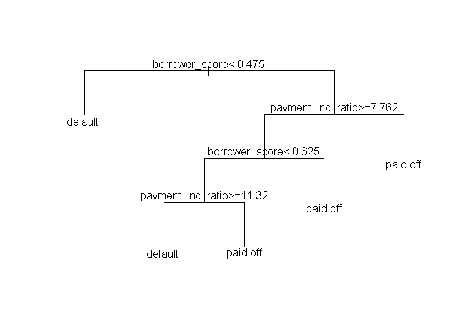

데이터과학을 위한 통계 6장
================

# 기초설정

``` r
library(tidyverse)
```

    ## -- Attaching packages --------------------------------------- tidyverse 1.3.0 --

    ## √ ggplot2 3.3.2     √ purrr   0.3.4
    ## √ tibble  3.0.4     √ dplyr   1.0.2
    ## √ tidyr   1.1.2     √ stringr 1.4.0
    ## √ readr   1.4.0     √ forcats 0.5.0

    ## -- Conflicts ------------------------------------------ tidyverse_conflicts() --
    ## x dplyr::filter() masks stats::filter()
    ## x dplyr::lag()    masks stats::lag()

## 1\. KNN 알고리즘

1.  특징들이 가장 유사한(예측변수들이 유사한) K개의 레코드를 찾는다.

2.  이 유사한 레코드들 중에 다수가 속한 클래스가 무엇인지 찾은 후에 새로운 레코드를 그 클래스에 할당한다.

3.  예측(KNN 회귀): 유사한 레코드들의 평균을 찾아서 새로운 레코드에 대한 예측값으로 사용한다.

회귀와는 달리 모델을 피팅하는 과정이 필요없는 간편한 예측/분류 방법이다.

모든 예측변수는 **수치형**이어야 한다.

``` r
library(FNN)
loan200 <- read_csv(file = "C:\\Users\\rkdal\\OneDrive\\바탕 화면\\월간R프로젝트\\데이터과학을위한통계\\psds_data\\loan200.csv")
```

    ## 
    ## -- Column specification --------------------------------------------------------
    ## cols(
    ##   outcome = col_character(),
    ##   payment_inc_ratio = col_double(),
    ##   dti = col_double()
    ## )

``` r
loan200 <- as.data.frame(loan200)

# 첫째행을 실험값으로 사용
newloan <- loan200[1, 2:3, drop=FALSE]

# knn 적합
knn_pred <- knn(train = loan200[-1, 2:3], test=newloan, cl = loan200[-1, 1], k=20)

# 실험값의 결과 확인하기
knn_pred == "paid off"
```

    ## [1] TRUE

knn에서 유사성은 **거리 지표**를 통해 결정된다. 두 벡터 사이에 가장 많이 사용되는 지표는 **유클리드 거리**이다. 두
벡터 사이의 차이에 대한 제곱합을 구한 뒤 그 값의 제곱근을 취한다.

다음으로 많이 사용하는 거리는 **맨하탄 거리**이다. 맨하탄 거리는 점과 점 사이의 이동 시간으로 급접성을 따질 때 좋은 지표가
된다.

#### 표준화

표준화 혹은 정규화란, 모든 변수에서 평균을 빼고 표준편차로 나누는 과정을 통해 변수들을 모두 비슷한 스케일에 넣는 것이다.
이러한 방식은 실제 측정된 값의 스케일 때문에 모델에 심한 영향을 주는 것을 막을 수 있다.

표준화값을 보통 **Z값**이라고 부른다.

KNN이나 다른 알고리즘에서는 데이터를 미리 표준화하는 것이 필수이다.

이 아래 두 코드 이해를 잘 못했음.

``` r
loan <- read_csv(file = "C:\\Users\\rkdal\\OneDrive\\바탕 화면\\월간R프로젝트\\데이터과학을위한통계\\psds_data\\loan_data.csv")
```

    ## Warning: Missing column names filled in: 'X1' [1]

    ## 
    ## -- Column specification --------------------------------------------------------
    ## cols(
    ##   .default = col_double(),
    ##   status = col_character(),
    ##   term = col_character(),
    ##   purpose = col_character(),
    ##   home_ownership = col_character(),
    ##   outcome = col_character(),
    ##   purpose_ = col_character(),
    ##   home_ = col_character(),
    ##   emp_len_ = col_character()
    ## )
    ## i Use `spec()` for the full column specifications.

``` r
# 새로운 실험값(revol_bal 값의 단위가 큼)
newloan <- loan[1, c("payment_inc_ratio", "dti", "revol_bal", "revol_util"), drop=FALSE]

outcome <- loan$outcome

# -1은 절편을 제외하겠다는 뜻임.
loan_df <- model.matrix(~ -1 + payment_inc_ratio + dti + revol_bal + revol_util,
                        data=loan)

knn_pred <- knn(train = loan_df, test = newloan, cl=outcome, k=5)

loan_df[attr(knn_pred, "nn.index"), ]
```

    ##       payment_inc_ratio  dti revol_bal revol_util
    ## 1               2.39320 1.00      1687        9.4
    ## 35537           1.47212 1.46      1686       10.0
    ## 33652           3.38178 6.37      1688        8.4
    ## 25864           2.36303 1.39      1691        3.5
    ## 42954           1.28160 7.14      1684        3.9

``` r
# scale 함수를 이용한 데이터 표준화
loan_std <- scale(loan_df)
newloan_std <- loan_std[1, c("payment_inc_ratio", "dti", "revol_bal", "revol_util"), drop=FALSE]

knn_pred <- knn(train = loan_std, test = newloan_std, cl=outcome, k=5)

# 표준화 후 새롭게 얻은 5개의 최근접 이웃들은 모든 변수에서 훨씬 더 유사해졌다.
loan_df[attr(knn_pred, "nn.index"), ]
```

    ##       payment_inc_ratio  dti revol_bal revol_util
    ## 1               2.39320 1.00      1687        9.4
    ## 2081            2.61091 1.03      1218        9.7
    ## 1439            2.34343 0.51       278        9.9
    ## 30216           2.71200 1.34      1075        8.5
    ## 28543           2.39760 0.74      2917        7.4

#### K 선택하기

k를 잘 선택하는 것은 KNN의 성능을 결정하는 중요한 요소이다. 가장 간단한 방법은 K = 1로 두는 것이다. 이는 1-최근접
이웃 분류기가 된다. 새로 들어온 데이터와 가장 가까운 데이터를 찾아 예측 결과로 사용한다.

일반적으로 K가 너무 작으면 오버피팅 문제가 발생한다. 반대로 K가 너무 크면 결정 함수가 과하게 평탄화되어 KNN의 예측 기능을
잃어버리게 된다.

보통 K를 1에서 20 사이에 놓는다. 동률이 나오는 경우를 막기 위해 보통은 홀수를 사용한다.

#### knn을 통한 피처 엔지니어링

KNN은 실용적인 측면에서, 다른 분류 방법들의 특정 단계에 사용할 수 있게 모델에 **지역적 정보**를 추가할 수 있다.

  - KNN 은 데이터에 기반하여 분류 결과(클래스에 속할 확률)를 얻는다.
  - 이 결과는 해당 레코드에 새로운 특징(피처)으로 추가된다. 이 결과를 다른 분류 방법에 사용한다.

<!-- end list -->

``` r
# 대출자의 신용정보를 나타내는 피처 만들기
borrow_df <- model.matrix(~ -1 + dti + revol_bal + revol_util + open_acc + delinq_2yrs_zero + pub_rec_zero, data = loan)

borrow_knn <- knn(borrow_df, test = borrow_df, cl=loan$outcome, prob = TRUE, k=10)

prob <- attr(borrow_knn, "prob")

borrow_feature <- ifelse(borrow_knn=="default", prob, 1-prob)

summary(borrow_feature)
```

    ##    Min. 1st Qu.  Median    Mean 3rd Qu.    Max. 
    ##  0.0000  0.4000  0.5000  0.5004  0.6000  1.0000

신용 기록을 기초로 대출자가 대출을 갚지 못할 것으로 예상되는 정도를 나타내는 피처를 만들었다.

참고로 **model.matrix**는 선형 모형에 적합하기 좋은 행렬로 변환시켜주는 함수이다.

formula를 넣으면 그거에 맞는 데이터프레임을 반환시켜주는 함수같다.

## 2\. 트리 모델

회귀 및 분류 트리(CART), 의사 결정 트리라고 부르며, 랜덤 포레스트 및 부스팅 방식과 같은 강력한 방법들이 파생됐다.

``` r
# 간단한 트리모형 만들고, 그래프 보기
library(rpart)

loan_tree <- rpart(outcome ~ borrower_score + payment_inc_ratio,
                   data = loan, control = rpart.control(cp=.005))

plot(loan_tree, uniform = TRUE, margin = .05)
text(loan_tree)
```

<!-- -->

``` r
summary(loan_tree)
```

    ## Call:
    ## rpart(formula = outcome ~ borrower_score + payment_inc_ratio, 
    ##     data = loan, control = rpart.control(cp = 0.005))
    ##   n= 45342 
    ## 
    ##            CP nsplit rel error    xerror        xstd
    ## 1 0.226544925      0 1.0000000 1.0080279 0.004696082
    ## 2 0.009373208      1 0.7734551 0.7734551 0.004574135
    ## 3 0.008998280      3 0.7547087 0.7638393 0.004563396
    ## 4 0.005000000      4 0.7457104 0.7477394 0.004544354
    ## 
    ## Variable importance
    ##    borrower_score payment_inc_ratio 
    ##                78                22 
    ## 
    ## Node number 1: 45342 observations,    complexity param=0.2265449
    ##   predicted class=default   expected loss=0.5  P(node) =1
    ##     class counts: 22671 22671
    ##    probabilities: 0.500 0.500 
    ##   left son=2 (19422 obs) right son=3 (25920 obs)
    ##   Primary splits:
    ##       borrower_score    < 0.475    to the left,  improve=1187.9320, (0 missing)
    ##       payment_inc_ratio < 9.998075 to the right, improve= 560.6614, (0 missing)
    ##   Surrogate splits:
    ##       payment_inc_ratio < 13.71475 to the right, agree=0.573, adj=0.002, (0 split)
    ## 
    ## Node number 2: 19422 observations
    ##   predicted class=default   expected loss=0.3677788  P(node) =0.4283446
    ##     class counts: 12279  7143
    ##    probabilities: 0.632 0.368 
    ## 
    ## Node number 3: 25920 observations,    complexity param=0.009373208
    ##   predicted class=paid off  expected loss=0.4009259  P(node) =0.5716554
    ##     class counts: 10392 15528
    ##    probabilities: 0.401 0.599 
    ##   left son=6 (11528 obs) right son=7 (14392 obs)
    ##   Primary splits:
    ##       payment_inc_ratio < 7.762325 to the right, improve=310.6633, (0 missing)
    ##       borrower_score    < 0.625    to the left,  improve=251.1470, (0 missing)
    ## 
    ## Node number 6: 11528 observations,    complexity param=0.009373208
    ##   predicted class=paid off  expected loss=0.4874219  P(node) =0.2542455
    ##     class counts:  5619  5909
    ##    probabilities: 0.487 0.513 
    ##   left son=12 (8549 obs) right son=13 (2979 obs)
    ##   Primary splits:
    ##       borrower_score    < 0.625    to the left,  improve=92.72126, (0 missing)
    ##       payment_inc_ratio < 11.1375  to the right, improve=62.66701, (0 missing)
    ## 
    ## Node number 7: 14392 observations
    ##   predicted class=paid off  expected loss=0.3316426  P(node) =0.3174099
    ##     class counts:  4773  9619
    ##    probabilities: 0.332 0.668 
    ## 
    ## Node number 12: 8549 observations,    complexity param=0.00899828
    ##   predicted class=default   expected loss=0.4751433  P(node) =0.1885448
    ##     class counts:  4487  4062
    ##    probabilities: 0.525 0.475 
    ##   left son=24 (4009 obs) right son=25 (4540 obs)
    ##   Primary splits:
    ##       payment_inc_ratio < 11.31995 to the right, improve=43.36326, (0 missing)
    ##       borrower_score    < 0.575    to the left,  improve=15.09420, (0 missing)
    ## 
    ## Node number 13: 2979 observations
    ##   predicted class=paid off  expected loss=0.3799933  P(node) =0.06570067
    ##     class counts:  1132  1847
    ##    probabilities: 0.380 0.620 
    ## 
    ## Node number 24: 4009 observations
    ##   predicted class=default   expected loss=0.4215515  P(node) =0.08841692
    ##     class counts:  2319  1690
    ##    probabilities: 0.578 0.422 
    ## 
    ## Node number 25: 4540 observations
    ##   predicted class=paid off  expected loss=0.477533  P(node) =0.1001279
    ##     class counts:  2168  2372
    ##    probabilities: 0.478 0.522

트리의 각 분할 영역에 대한 동질성(클래스 순도), 불순도를 측정할 수 있다.

**지니 불순도**와 **엔트로피**가 대표적인 불순도 측정 지표이다.

트리의 형성이 길어질수록 오버피팅의 위험이 있기 때문에 가지치기를 한다.

복잡도 파라미터 cp를 이용하면, 어떤 크기의 트리가 새로운 데이터에 대해 가장 좋은 성능을 보일지 추정할 수 있다. cp가
작다면, 오버피팅, cp가 크다면 예측 능력을 갖질 못한다.

트리의 장점은 **블랙박스 모형**이 아니라는 점이다.

따라서 다음과 같은 장점을 갖는다.

  - 데이터 탐색을 위한 시각화가 가능하다. 데이터간 비선형 관계도 담아낼 수 있기 때문에, 변수 간에 어떤 관계가 있고, 어떤
    변수가 중요한지를 확인할 수 있다.
  - 일종의 규칙들의 집합이라고 볼 수 있기 때문에, 비전문가들과 대화하는데 효과적이다.
