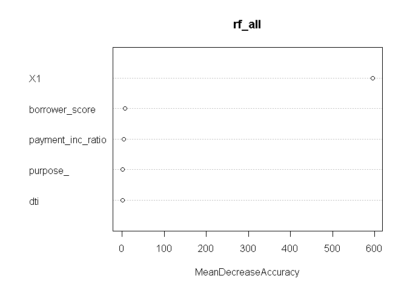
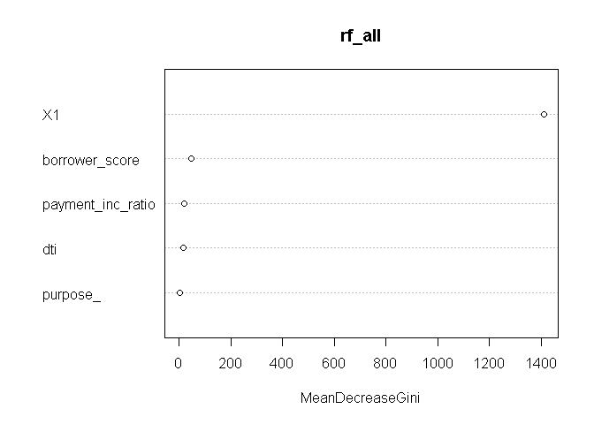

데이터과학을 위한 통계 6장
================

# 기초설정

``` r
library(tidyverse)
```

    ## -- Attaching packages --------------------------------------- tidyverse 1.3.0 --

    ## √ ggplot2 3.3.2     √ purrr   0.3.4
    ## √ tibble  3.0.4     √ dplyr   1.0.2
    ## √ tidyr   1.1.2     √ stringr 1.4.0
    ## √ readr   1.4.0     √ forcats 0.5.0

    ## -- Conflicts ------------------------------------------ tidyverse_conflicts() --
    ## x dplyr::filter() masks stats::filter()
    ## x dplyr::lag()    masks stats::lag()

## 1\. KNN 알고리즘

1.  특징들이 가장 유사한(예측변수들이 유사한) K개의 레코드를 찾는다.

2.  이 유사한 레코드들 중에 다수가 속한 클래스가 무엇인지 찾은 후에 새로운 레코드를 그 클래스에 할당한다.

3.  예측(KNN 회귀): 유사한 레코드들의 평균을 찾아서 새로운 레코드에 대한 예측값으로 사용한다.

회귀와는 달리 모델을 피팅하는 과정이 필요없는 간편한 예측/분류 방법이다.

모든 예측변수는 **수치형**이어야 한다.

``` r
library(FNN)
loan200 <- read_csv(file = "C:\\Users\\rkdal\\OneDrive\\바탕 화면\\월간R프로젝트\\데이터과학을위한통계\\psds_data\\loan200.csv")
```

    ## 
    ## -- Column specification --------------------------------------------------------
    ## cols(
    ##   outcome = col_character(),
    ##   payment_inc_ratio = col_double(),
    ##   dti = col_double()
    ## )

``` r
loan200 <- as.data.frame(loan200)

# 첫째행을 실험값으로 사용
newloan <- loan200[1, 2:3, drop=FALSE]

# knn 적합
knn_pred <- knn(train = loan200[-1, 2:3], test=newloan, cl = loan200[-1, 1], k=20)

# 실험값의 결과 확인하기
knn_pred == "paid off"
```

    ## [1] TRUE

knn에서 유사성은 **거리 지표**를 통해 결정된다. 두 벡터 사이에 가장 많이 사용되는 지표는 **유클리드 거리**이다. 두
벡터 사이의 차이에 대한 제곱합을 구한 뒤 그 값의 제곱근을 취한다.

다음으로 많이 사용하는 거리는 **맨하탄 거리**이다. 맨하탄 거리는 점과 점 사이의 이동 시간으로 급접성을 따질 때 좋은 지표가
된다.

#### 표준화

표준화 혹은 정규화란, 모든 변수에서 평균을 빼고 표준편차로 나누는 과정을 통해 변수들을 모두 비슷한 스케일에 넣는 것이다.
이러한 방식은 실제 측정된 값의 스케일 때문에 모델에 심한 영향을 주는 것을 막을 수 있다.

표준화값을 보통 **Z값**이라고 부른다.

KNN이나 다른 알고리즘에서는 데이터를 미리 표준화하는 것이 필수이다.

이 아래 두 코드 이해를 잘 못했음.

``` r
loan <- read_csv(file = "C:\\Users\\rkdal\\OneDrive\\바탕 화면\\월간R프로젝트\\데이터과학을위한통계\\psds_data\\loan_data.csv")
```

    ## Warning: Missing column names filled in: 'X1' [1]

    ## 
    ## -- Column specification --------------------------------------------------------
    ## cols(
    ##   .default = col_double(),
    ##   status = col_character(),
    ##   term = col_character(),
    ##   purpose = col_character(),
    ##   home_ownership = col_character(),
    ##   outcome = col_character(),
    ##   purpose_ = col_character(),
    ##   home_ = col_character(),
    ##   emp_len_ = col_character()
    ## )
    ## i Use `spec()` for the full column specifications.

``` r
# 새로운 실험값(revol_bal 값의 단위가 큼)
newloan <- loan[1, c("payment_inc_ratio", "dti", "revol_bal", "revol_util"), drop=FALSE]

outcome <- loan$outcome

# -1은 절편을 제외하겠다는 뜻임.
loan_df <- model.matrix(~ -1 + payment_inc_ratio + dti + revol_bal + revol_util,
                        data=loan)

knn_pred <- knn(train = loan_df, test = newloan, cl=outcome, k=5)

loan_df[attr(knn_pred, "nn.index"), ]
```

    ##       payment_inc_ratio  dti revol_bal revol_util
    ## 1               2.39320 1.00      1687        9.4
    ## 35537           1.47212 1.46      1686       10.0
    ## 33652           3.38178 6.37      1688        8.4
    ## 25864           2.36303 1.39      1691        3.5
    ## 42954           1.28160 7.14      1684        3.9

``` r
# scale 함수를 이용한 데이터 표준화
loan_std <- scale(loan_df)
newloan_std <- loan_std[1, c("payment_inc_ratio", "dti", "revol_bal", "revol_util"), drop=FALSE]

knn_pred <- knn(train = loan_std, test = newloan_std, cl=outcome, k=5)

# 표준화 후 새롭게 얻은 5개의 최근접 이웃들은 모든 변수에서 훨씬 더 유사해졌다.
loan_df[attr(knn_pred, "nn.index"), ]
```

    ##       payment_inc_ratio  dti revol_bal revol_util
    ## 1               2.39320 1.00      1687        9.4
    ## 2081            2.61091 1.03      1218        9.7
    ## 1439            2.34343 0.51       278        9.9
    ## 30216           2.71200 1.34      1075        8.5
    ## 28543           2.39760 0.74      2917        7.4

#### K 선택하기

k를 잘 선택하는 것은 KNN의 성능을 결정하는 중요한 요소이다. 가장 간단한 방법은 K = 1로 두는 것이다. 이는 1-최근접
이웃 분류기가 된다. 새로 들어온 데이터와 가장 가까운 데이터를 찾아 예측 결과로 사용한다.

일반적으로 K가 너무 작으면 오버피팅 문제가 발생한다. 반대로 K가 너무 크면 결정 함수가 과하게 평탄화되어 KNN의 예측 기능을
잃어버리게 된다.

보통 K를 1에서 20 사이에 놓는다. 동률이 나오는 경우를 막기 위해 보통은 홀수를 사용한다.

#### knn을 통한 피처 엔지니어링

KNN은 실용적인 측면에서, 다른 분류 방법들의 특정 단계에 사용할 수 있게 모델에 **지역적 정보**를 추가할 수 있다.

  - KNN 은 데이터에 기반하여 분류 결과(클래스에 속할 확률)를 얻는다.
  - 이 결과는 해당 레코드에 새로운 특징(피처)으로 추가된다. 이 결과를 다른 분류 방법에 사용한다.

<!-- end list -->

``` r
# 대출자의 신용정보를 나타내는 피처 만들기
borrow_df <- model.matrix(~ -1 + dti + revol_bal + revol_util + open_acc + delinq_2yrs_zero + pub_rec_zero, data = loan)

borrow_knn <- knn(borrow_df, test = borrow_df, cl=loan$outcome, prob = TRUE, k=10)

prob <- attr(borrow_knn, "prob")

borrow_feature <- ifelse(borrow_knn=="default", prob, 1-prob)

summary(borrow_feature)
```

    ##    Min. 1st Qu.  Median    Mean 3rd Qu.    Max. 
    ##  0.0000  0.4000  0.5000  0.5004  0.6000  1.0000

신용 기록을 기초로 대출자가 대출을 갚지 못할 것으로 예상되는 정도를 나타내는 피처를 만들었다.

참고로 **model.matrix**는 선형 모형에 적합하기 좋은 행렬로 변환시켜주는 함수이다.

formula를 넣으면 그거에 맞는 데이터프레임을 반환시켜주는 함수같다.

## 2\. 트리 모델

회귀 및 분류 트리(CART), 의사 결정 트리라고 부르며, 랜덤 포레스트 및 부스팅 방식과 같은 강력한 방법들이 파생됐다.

``` r
# 간단한 트리모형 만들고, 그래프 보기
library(rpart)

loan_tree <- rpart(outcome ~ borrower_score + payment_inc_ratio,
                   data = loan, control = rpart.control(cp=.005))

plot(loan_tree, uniform = TRUE, margin = .05)
text(loan_tree)
```

<!-- -->

``` r
summary(loan_tree)
```

    ## Call:
    ## rpart(formula = outcome ~ borrower_score + payment_inc_ratio, 
    ##     data = loan, control = rpart.control(cp = 0.005))
    ##   n= 45342 
    ## 
    ##            CP nsplit rel error    xerror        xstd
    ## 1 0.226544925      0 1.0000000 1.0079838 0.004696084
    ## 2 0.009373208      1 0.7734551 0.7734551 0.004574135
    ## 3 0.008998280      3 0.7547087 0.7643686 0.004563999
    ## 4 0.005000000      4 0.7457104 0.7471660 0.004543651
    ## 
    ## Variable importance
    ##    borrower_score payment_inc_ratio 
    ##                78                22 
    ## 
    ## Node number 1: 45342 observations,    complexity param=0.2265449
    ##   predicted class=default   expected loss=0.5  P(node) =1
    ##     class counts: 22671 22671
    ##    probabilities: 0.500 0.500 
    ##   left son=2 (19422 obs) right son=3 (25920 obs)
    ##   Primary splits:
    ##       borrower_score    < 0.475    to the left,  improve=1187.9320, (0 missing)
    ##       payment_inc_ratio < 9.998075 to the right, improve= 560.6614, (0 missing)
    ##   Surrogate splits:
    ##       payment_inc_ratio < 13.71475 to the right, agree=0.573, adj=0.002, (0 split)
    ## 
    ## Node number 2: 19422 observations
    ##   predicted class=default   expected loss=0.3677788  P(node) =0.4283446
    ##     class counts: 12279  7143
    ##    probabilities: 0.632 0.368 
    ## 
    ## Node number 3: 25920 observations,    complexity param=0.009373208
    ##   predicted class=paid off  expected loss=0.4009259  P(node) =0.5716554
    ##     class counts: 10392 15528
    ##    probabilities: 0.401 0.599 
    ##   left son=6 (11528 obs) right son=7 (14392 obs)
    ##   Primary splits:
    ##       payment_inc_ratio < 7.762325 to the right, improve=310.6633, (0 missing)
    ##       borrower_score    < 0.625    to the left,  improve=251.1470, (0 missing)
    ## 
    ## Node number 6: 11528 observations,    complexity param=0.009373208
    ##   predicted class=paid off  expected loss=0.4874219  P(node) =0.2542455
    ##     class counts:  5619  5909
    ##    probabilities: 0.487 0.513 
    ##   left son=12 (8549 obs) right son=13 (2979 obs)
    ##   Primary splits:
    ##       borrower_score    < 0.625    to the left,  improve=92.72126, (0 missing)
    ##       payment_inc_ratio < 11.1375  to the right, improve=62.66701, (0 missing)
    ## 
    ## Node number 7: 14392 observations
    ##   predicted class=paid off  expected loss=0.3316426  P(node) =0.3174099
    ##     class counts:  4773  9619
    ##    probabilities: 0.332 0.668 
    ## 
    ## Node number 12: 8549 observations,    complexity param=0.00899828
    ##   predicted class=default   expected loss=0.4751433  P(node) =0.1885448
    ##     class counts:  4487  4062
    ##    probabilities: 0.525 0.475 
    ##   left son=24 (4009 obs) right son=25 (4540 obs)
    ##   Primary splits:
    ##       payment_inc_ratio < 11.31995 to the right, improve=43.36326, (0 missing)
    ##       borrower_score    < 0.575    to the left,  improve=15.09420, (0 missing)
    ## 
    ## Node number 13: 2979 observations
    ##   predicted class=paid off  expected loss=0.3799933  P(node) =0.06570067
    ##     class counts:  1132  1847
    ##    probabilities: 0.380 0.620 
    ## 
    ## Node number 24: 4009 observations
    ##   predicted class=default   expected loss=0.4215515  P(node) =0.08841692
    ##     class counts:  2319  1690
    ##    probabilities: 0.578 0.422 
    ## 
    ## Node number 25: 4540 observations
    ##   predicted class=paid off  expected loss=0.477533  P(node) =0.1001279
    ##     class counts:  2168  2372
    ##    probabilities: 0.478 0.522

트리의 각 분할 영역에 대한 동질성(클래스 순도), 불순도를 측정할 수 있다.

**지니 불순도**와 **엔트로피**가 대표적인 불순도 측정 지표이다.

트리의 형성이 길어질수록 오버피팅의 위험이 있기 때문에 가지치기를 한다.

복잡도 파라미터 cp를 이용하면, 어떤 크기의 트리가 새로운 데이터에 대해 가장 좋은 성능을 보일지 추정할 수 있다. cp가
작다면, 오버피팅, cp가 크다면 예측 능력을 갖질 못한다.

트리의 장점은 **블랙박스 모형**이 아니라는 점이다.

따라서 다음과 같은 장점을 갖는다.

  - 데이터 탐색을 위한 시각화가 가능하다. 데이터간 비선형 관계도 담아낼 수 있기 때문에, 변수 간에 어떤 관계가 있고, 어떤
    변수가 중요한지를 확인할 수 있다.
  - 일종의 규칙들의 집합이라고 볼 수 있기 때문에, 비전문가들과 대화하는데 효과적이다.

## 3\. 배깅과 랜덤 포레스트

단일 모델을 엄청나게 많이 만들어놓고, 다수결 투표 혹은 다중 모델의 평균을 내는 방식으로 최종 모델을 결정하는 것이 **앙상블
모델**이다.

**배깅**과 **부스팅**은 앙상블 모델을 만드는 방법이다.

배깅은 다양한 모델들을 정확히 같은 데이터에 대해 구하는 대신, 매번 부트스트랩 재표본에 대해 새로운 모델을 만든다.

랜덤 포레스트는 배깅 방법을 적용한 모델이다.

``` r
library(randomForest)
```

    ## randomForest 4.6-14

    ## Type rfNews() to see new features/changes/bug fixes.

    ## 
    ## Attaching package: 'randomForest'

    ## The following object is masked from 'package:dplyr':
    ## 
    ##     combine

    ## The following object is masked from 'package:ggplot2':
    ## 
    ##     margin

``` r
loan3000 <- read_csv(file = "C:\\Users\\rkdal\\OneDrive\\바탕 화면\\월간R프로젝트\\데이터과학을위한통계\\psds_data\\loan3000.csv")
```

    ## Warning: Missing column names filled in: 'X1' [1]

    ## 
    ## -- Column specification --------------------------------------------------------
    ## cols(
    ##   X1 = col_double(),
    ##   outcome = col_character(),
    ##   purpose_ = col_character(),
    ##   dti = col_double(),
    ##   borrower_score = col_double(),
    ##   payment_inc_ratio = col_double()
    ## )

``` r
loan3000 <- as.data.frame(loan3000)

# 문자형을 수치로 변환
loan3000$outcome <- ifelse(loan3000$outcome == "paid off",
                           1, 0)

# 범주형 자료로 변환
loan3000$outcome <- as.factor(loan3000$outcome)

# 랜덤 포레스트 모델
rf <- randomForest(outcome ~ borrower_score + payment_inc_ratio,
                   data = loan3000)

# 예측
pred <- predict(rf)
summary(pred)
```

    ##    0    1 
    ## 1483 1517

랜덤포레스트는 블랙박스 모델이다. 직관적인 해석은 불가능하다. 또한 오버피팅의 위험성이 다소 높다고 볼 수 있다.

``` r
# 랜덤포레스트를 통한 변수 중요도 찾기
rf_all <- randomForest(outcome ~.,
                       data = loan3000,
                       importance = TRUE)

rf_all$importance
```

    ##                               0            1 MeanDecreaseAccuracy
    ## X1                 5.133385e-01 0.4748574135         0.4931120401
    ## purpose_          -5.225436e-05 0.0002408660         0.0001009231
    ## dti                1.986187e-04 0.0003721224         0.0002923739
    ## borrower_score     1.000675e-03 0.0005397931         0.0007668474
    ## payment_inc_ratio  4.491640e-04 0.0006131356         0.0005355824
    ##                   MeanDecreaseGini
    ## X1                     1410.576914
    ## purpose_                  4.041977
    ## dti                      13.993495
    ## borrower_score           49.863826
    ## payment_inc_ratio        19.158585

``` r
varImpPlot(rf_all, type=1)
```

<!-- -->

``` r
varImpPlot(rf_all, type=2)
```

<!-- -->

해당 변수가 예측에 미치는 영향력이 제거 되었을 때, 감소하는 정확도와 지니 불순도 점수의 감소량을 측정한다.

#### 하이퍼 파라미터

다른 딥러닝/머신러닝 알고리즘들과 마찬가지로, 랜덤 포레스트는 성능을 조절할 수 있는 손잡이가 달려있다.

이러한 손잡이를 **하이퍼파라미터**라고 부른다.

  - nodesize : 말단 노드의 크기를 의미한다. 분류를 위한 기본 설정은 1이며, 회귀 문제에서는 5이다.
  - maxnodes : 각 결정 트리에서 전체 노드의 최대 개수를 의미한다. 기본적인 제한이 없고, 다만 nodesize 제한
    설정에 따라 가장 큰 트리의 크기가 결정된다.

nodesize와 maxnodes를 크게 하면 더 작은 트리를 얻게되고, 오버피팅을 피할 수 있게 된다.

## 4\. 부스팅

배깅은 상대적으로 튜닝이 거의 필요 없지만, 문제에 따라서 상당한 튜닝이 필요할 수도 있다.

  - **에이다부스트** : 잔차에 따라 데이터의 가중치를 조절하는 부스팅의 초기 버전
  - **그레이디언트 부스팅** : 비용함수를 최소화하는 방향으로 부스팅을 활용하는 좀 더 일반적인 형태
  - **확률적 그레이디언트 부스팅** : 각 라운드마다 레코드와 열을 재표본추출하는 것을 포함하는 부스팅의 가장 일반적인 형태

부스팅 방식에는 이미 재표본추출이라는 개념이 있어서 전처리를 한 데이터를 추가로 더 보강할 필요가 있을까? 파라미터를 조정하면
되는 것 아닌가?

에이다부스트의 원리를 간단히 알아보면 다음과 같다.

  - 피팅할 모델의 개수 M을 설정한다.
  - 반복 횟수 및 관측 가중치를 초기화한다.
  - 관측 가중치를 이용하여 모델을 학습시킨다.
  - 잘못 분류된 입력 데이터에 대한 가중치를 증가하는 방향으로 가중치를 업데이터한다.
  - 반복한다.

#### XG부스트

확률적 그레이디언트 부스팅을 구현한 이 소프트웨어는 워싱턴 대학교에서 개발되었다.

xgboost 함수는 우리가 직접 조정할 수 있는 다양한 파라미터들을 제공한다. 이 중 가장 중요한 파라미터 두 가지는
**subsample**과 **eta**라고 할 수 있다.

  - subsample : 각 반복 구간마다 샘플링할 입력 데이터의 비율을 조정한다.
  - eta(학습률) : 부스팅 알고리즘에서 a에 적용되는 축소 비율을 결정한다.

eta는 가중치 변화량을 낮추어 오버피팅을 방지하는 효과가 있다. 가중치를 조금씩 변화시키는 것은 알고리즘이 학습 데이터에
오버피팅될 수 있는 가능성을 줄여준다.

``` r
library(xgboost)
```

    ## 
    ## Attaching package: 'xgboost'

    ## The following object is masked from 'package:dplyr':
    ## 
    ##     slice

``` r
# 이런 편리한 함수가 있는지 몰랐다.
predictors <- data.matrix(loan3000[, c("borrower_score", "payment_inc_ratio")])

loan3000$outcome <- as.factor(loan3000$outcome)

# 목표변수를 라벨링해야함.
label <- as.numeric(loan3000[,"outcome"])-1

xgb <- xgboost(data=predictors,
               label = label,
               objective = "binary:logistic",
               params = list(subsample = .63, eta=0.1), nrounds = 100)
```

    ## [01:39:17] WARNING: amalgamation/../src/learner.cc:1061: Starting in XGBoost 1.3.0, the default evaluation metric used with the objective 'binary:logistic' was changed from 'error' to 'logloss'. Explicitly set eval_metric if you'd like to restore the old behavior.
    ## [1]  train-logloss:0.680453 
    ## [2]  train-logloss:0.668480 
    ## [3]  train-logloss:0.659631 
    ## [4]  train-logloss:0.652096 
    ## [5]  train-logloss:0.644626 
    ## [6]  train-logloss:0.637991 
    ## [7]  train-logloss:0.632133 
    ## [8]  train-logloss:0.627103 
    ## [9]  train-logloss:0.623372 
    ## [10] train-logloss:0.618847 
    ## [11] train-logloss:0.615258 
    ## [12] train-logloss:0.612163 
    ## [13] train-logloss:0.609359 
    ## [14] train-logloss:0.606158 
    ## [15] train-logloss:0.604643 
    ## [16] train-logloss:0.602058 
    ## [17] train-logloss:0.600431 
    ## [18] train-logloss:0.597991 
    ## [19] train-logloss:0.595566 
    ## [20] train-logloss:0.594411 
    ## [21] train-logloss:0.592594 
    ## [22] train-logloss:0.591274 
    ## [23] train-logloss:0.590513 
    ## [24] train-logloss:0.587514 
    ## [25] train-logloss:0.585846 
    ## [26] train-logloss:0.584636 
    ## [27] train-logloss:0.583648 
    ## [28] train-logloss:0.582386 
    ## [29] train-logloss:0.581059 
    ## [30] train-logloss:0.579946 
    ## [31] train-logloss:0.579027 
    ## [32] train-logloss:0.578004 
    ## [33] train-logloss:0.576315 
    ## [34] train-logloss:0.575360 
    ## [35] train-logloss:0.574221 
    ## [36] train-logloss:0.573489 
    ## [37] train-logloss:0.572649 
    ## [38] train-logloss:0.572067 
    ## [39] train-logloss:0.571096 
    ## [40] train-logloss:0.569870 
    ## [41] train-logloss:0.568496 
    ## [42] train-logloss:0.567621 
    ## [43] train-logloss:0.566691 
    ## [44] train-logloss:0.565960 
    ## [45] train-logloss:0.565127 
    ## [46] train-logloss:0.564583 
    ## [47] train-logloss:0.562888 
    ## [48] train-logloss:0.561456 
    ## [49] train-logloss:0.560758 
    ## [50] train-logloss:0.560032 
    ## [51] train-logloss:0.558470 
    ## [52] train-logloss:0.556866 
    ## [53] train-logloss:0.556030 
    ## [54] train-logloss:0.555037 
    ## [55] train-logloss:0.554354 
    ## [56] train-logloss:0.553355 
    ## [57] train-logloss:0.552115 
    ## [58] train-logloss:0.551321 
    ## [59] train-logloss:0.550152 
    ## [60] train-logloss:0.549887 
    ## [61] train-logloss:0.548482 
    ## [62] train-logloss:0.547456 
    ## [63] train-logloss:0.545935 
    ## [64] train-logloss:0.544630 
    ## [65] train-logloss:0.544434 
    ## [66] train-logloss:0.543755 
    ## [67] train-logloss:0.542820 
    ## [68] train-logloss:0.541524 
    ## [69] train-logloss:0.541218 
    ## [70] train-logloss:0.540575 
    ## [71] train-logloss:0.539934 
    ## [72] train-logloss:0.539645 
    ## [73] train-logloss:0.538589 
    ## [74] train-logloss:0.537687 
    ## [75] train-logloss:0.536643 
    ## [76] train-logloss:0.535125 
    ## [77] train-logloss:0.534607 
    ## [78] train-logloss:0.533617 
    ## [79] train-logloss:0.533185 
    ## [80] train-logloss:0.532178 
    ## [81] train-logloss:0.531124 
    ## [82] train-logloss:0.530516 
    ## [83] train-logloss:0.529773 
    ## [84] train-logloss:0.528961 
    ## [85] train-logloss:0.528437 
    ## [86] train-logloss:0.527468 
    ## [87] train-logloss:0.526813 
    ## [88] train-logloss:0.526440 
    ## [89] train-logloss:0.525815 
    ## [90] train-logloss:0.525025 
    ## [91] train-logloss:0.524197 
    ## [92] train-logloss:0.523712 
    ## [93] train-logloss:0.522672 
    ## [94] train-logloss:0.521966 
    ## [95] train-logloss:0.521601 
    ## [96] train-logloss:0.521001 
    ## [97] train-logloss:0.520577 
    ## [98] train-logloss:0.519567 
    ## [99] train-logloss:0.518703 
    ## [100]    train-logloss:0.518360

``` r
pred <- predict(xgb, newdata = predictors)
xgb_df <- cbind(loan3000, pred_default = pred>.5, prob_default=pred)

# 결과 그래프 출력
ggplot(data=xgb_df, aes(x=borrower_score, y=payment_inc_ratio, color=pred_default, shape=pred_default)) +
  geom_point(alpha=.6, size=2)
```

<!-- -->

xgboost는 수식이 포함된 문법을 지원하지 않기 때문에 예측변수는 data.matrix 형태로, 예측변수는 0/1 형태로
변형해서 사용해야 한다.

#### 정규화 : 오버피팅 피하기

``` r
loan_data <- read_csv(file = "C:\\Users\\rkdal\\OneDrive\\바탕 화면\\월간R프로젝트\\데이터과학을위한통계\\psds_data\\loan_data.csv")
```

    ## Warning: Missing column names filled in: 'X1' [1]

    ## 
    ## -- Column specification --------------------------------------------------------
    ## cols(
    ##   .default = col_double(),
    ##   status = col_character(),
    ##   term = col_character(),
    ##   purpose = col_character(),
    ##   home_ownership = col_character(),
    ##   outcome = col_character(),
    ##   purpose_ = col_character(),
    ##   home_ = col_character(),
    ##   emp_len_ = col_character()
    ## )
    ## i Use `spec()` for the full column specifications.

``` r
loan_data$X1 <- NULL

predictors <- data.matrix(loan_data[, -which(names(loan_data) %in% "outcome")])

loan_data$outcome <- as.factor(loan_data$outcome)

label <- as.numeric(loan_data$outcome)-1

test_idx <- sample(nrow(loan_data), 10000)

xgb_default <- xgboost(data=predictors[-test_idx, ],
                       label = label[-test_idx],
                       objective = "binary:logistic",
                       nrounds = 250)
```

    ## [01:39:19] WARNING: amalgamation/../src/learner.cc:1061: Starting in XGBoost 1.3.0, the default evaluation metric used with the objective 'binary:logistic' was changed from 'error' to 'logloss'. Explicitly set eval_metric if you'd like to restore the old behavior.
    ## [1]  train-logloss:0.437537 
    ## [2]  train-logloss:0.296339 
    ## [3]  train-logloss:0.207372 
    ## [4]  train-logloss:0.147849 
    ## [5]  train-logloss:0.106649 
    ## [6]  train-logloss:0.077541 
    ## [7]  train-logloss:0.056681 
    ## [8]  train-logloss:0.041589 
    ## [9]  train-logloss:0.030602 
    ## [10] train-logloss:0.022565 
    ## [11] train-logloss:0.016665 
    ## [12] train-logloss:0.012324 
    ## [13] train-logloss:0.009123 
    ## [14] train-logloss:0.006761 
    ## [15] train-logloss:0.005015 
    ## [16] train-logloss:0.003725 
    ## [17] train-logloss:0.002770 
    ## [18] train-logloss:0.002064 
    ## [19] train-logloss:0.001541 
    ## [20] train-logloss:0.001153 
    ## [21] train-logloss:0.000866 
    ## [22] train-logloss:0.000654 
    ## [23] train-logloss:0.000496 
    ## [24] train-logloss:0.000379 
    ## [25] train-logloss:0.000292 
    ## [26] train-logloss:0.000227 
    ## [27] train-logloss:0.000178 
    ## [28] train-logloss:0.000142 
    ## [29] train-logloss:0.000115 
    ## [30] train-logloss:0.000094 
    ## [31] train-logloss:0.000078 
    ## [32] train-logloss:0.000065 
    ## [33] train-logloss:0.000056 
    ## [34] train-logloss:0.000056 
    ## [35] train-logloss:0.000056 
    ## [36] train-logloss:0.000056 
    ## [37] train-logloss:0.000056 
    ## [38] train-logloss:0.000056 
    ## [39] train-logloss:0.000056 
    ## [40] train-logloss:0.000056 
    ## [41] train-logloss:0.000056 
    ## [42] train-logloss:0.000056 
    ## [43] train-logloss:0.000056 
    ## [44] train-logloss:0.000056 
    ## [45] train-logloss:0.000056 
    ## [46] train-logloss:0.000056 
    ## [47] train-logloss:0.000056 
    ## [48] train-logloss:0.000056 
    ## [49] train-logloss:0.000056 
    ## [50] train-logloss:0.000056 
    ## [51] train-logloss:0.000056 
    ## [52] train-logloss:0.000056 
    ## [53] train-logloss:0.000056 
    ## [54] train-logloss:0.000056 
    ## [55] train-logloss:0.000056 
    ## [56] train-logloss:0.000056 
    ## [57] train-logloss:0.000056 
    ## [58] train-logloss:0.000056 
    ## [59] train-logloss:0.000056 
    ## [60] train-logloss:0.000056 
    ## [61] train-logloss:0.000056 
    ## [62] train-logloss:0.000056 
    ## [63] train-logloss:0.000056 
    ## [64] train-logloss:0.000056 
    ## [65] train-logloss:0.000056 
    ## [66] train-logloss:0.000056 
    ## [67] train-logloss:0.000056 
    ## [68] train-logloss:0.000056 
    ## [69] train-logloss:0.000056 
    ## [70] train-logloss:0.000056 
    ## [71] train-logloss:0.000056 
    ## [72] train-logloss:0.000056 
    ## [73] train-logloss:0.000056 
    ## [74] train-logloss:0.000056 
    ## [75] train-logloss:0.000056 
    ## [76] train-logloss:0.000056 
    ## [77] train-logloss:0.000056 
    ## [78] train-logloss:0.000056 
    ## [79] train-logloss:0.000056 
    ## [80] train-logloss:0.000056 
    ## [81] train-logloss:0.000056 
    ## [82] train-logloss:0.000056 
    ## [83] train-logloss:0.000056 
    ## [84] train-logloss:0.000056 
    ## [85] train-logloss:0.000056 
    ## [86] train-logloss:0.000056 
    ## [87] train-logloss:0.000056 
    ## [88] train-logloss:0.000056 
    ## [89] train-logloss:0.000056 
    ## [90] train-logloss:0.000056 
    ## [91] train-logloss:0.000056 
    ## [92] train-logloss:0.000056 
    ## [93] train-logloss:0.000056 
    ## [94] train-logloss:0.000056 
    ## [95] train-logloss:0.000056 
    ## [96] train-logloss:0.000056 
    ## [97] train-logloss:0.000056 
    ## [98] train-logloss:0.000056 
    ## [99] train-logloss:0.000056 
    ## [100]    train-logloss:0.000056 
    ## [101]    train-logloss:0.000056 
    ## [102]    train-logloss:0.000056 
    ## [103]    train-logloss:0.000056 
    ## [104]    train-logloss:0.000056 
    ## [105]    train-logloss:0.000056 
    ## [106]    train-logloss:0.000056 
    ## [107]    train-logloss:0.000056 
    ## [108]    train-logloss:0.000056 
    ## [109]    train-logloss:0.000056 
    ## [110]    train-logloss:0.000056 
    ## [111]    train-logloss:0.000056 
    ## [112]    train-logloss:0.000056 
    ## [113]    train-logloss:0.000056 
    ## [114]    train-logloss:0.000056 
    ## [115]    train-logloss:0.000056 
    ## [116]    train-logloss:0.000056 
    ## [117]    train-logloss:0.000056 
    ## [118]    train-logloss:0.000056 
    ## [119]    train-logloss:0.000056 
    ## [120]    train-logloss:0.000056 
    ## [121]    train-logloss:0.000056 
    ## [122]    train-logloss:0.000056 
    ## [123]    train-logloss:0.000056 
    ## [124]    train-logloss:0.000056 
    ## [125]    train-logloss:0.000056 
    ## [126]    train-logloss:0.000056 
    ## [127]    train-logloss:0.000056 
    ## [128]    train-logloss:0.000056 
    ## [129]    train-logloss:0.000056 
    ## [130]    train-logloss:0.000056 
    ## [131]    train-logloss:0.000056 
    ## [132]    train-logloss:0.000056 
    ## [133]    train-logloss:0.000056 
    ## [134]    train-logloss:0.000056 
    ## [135]    train-logloss:0.000056 
    ## [136]    train-logloss:0.000056 
    ## [137]    train-logloss:0.000056 
    ## [138]    train-logloss:0.000056 
    ## [139]    train-logloss:0.000056 
    ## [140]    train-logloss:0.000056 
    ## [141]    train-logloss:0.000056 
    ## [142]    train-logloss:0.000056 
    ## [143]    train-logloss:0.000056 
    ## [144]    train-logloss:0.000056 
    ## [145]    train-logloss:0.000056 
    ## [146]    train-logloss:0.000056 
    ## [147]    train-logloss:0.000056 
    ## [148]    train-logloss:0.000056 
    ## [149]    train-logloss:0.000056 
    ## [150]    train-logloss:0.000056 
    ## [151]    train-logloss:0.000056 
    ## [152]    train-logloss:0.000056 
    ## [153]    train-logloss:0.000056 
    ## [154]    train-logloss:0.000056 
    ## [155]    train-logloss:0.000056 
    ## [156]    train-logloss:0.000056 
    ## [157]    train-logloss:0.000056 
    ## [158]    train-logloss:0.000056 
    ## [159]    train-logloss:0.000056 
    ## [160]    train-logloss:0.000056 
    ## [161]    train-logloss:0.000056 
    ## [162]    train-logloss:0.000056 
    ## [163]    train-logloss:0.000056 
    ## [164]    train-logloss:0.000056 
    ## [165]    train-logloss:0.000056 
    ## [166]    train-logloss:0.000056 
    ## [167]    train-logloss:0.000056 
    ## [168]    train-logloss:0.000056 
    ## [169]    train-logloss:0.000056 
    ## [170]    train-logloss:0.000056 
    ## [171]    train-logloss:0.000056 
    ## [172]    train-logloss:0.000056 
    ## [173]    train-logloss:0.000056 
    ## [174]    train-logloss:0.000056 
    ## [175]    train-logloss:0.000056 
    ## [176]    train-logloss:0.000056 
    ## [177]    train-logloss:0.000056 
    ## [178]    train-logloss:0.000056 
    ## [179]    train-logloss:0.000056 
    ## [180]    train-logloss:0.000056 
    ## [181]    train-logloss:0.000056 
    ## [182]    train-logloss:0.000056 
    ## [183]    train-logloss:0.000056 
    ## [184]    train-logloss:0.000056 
    ## [185]    train-logloss:0.000056 
    ## [186]    train-logloss:0.000056 
    ## [187]    train-logloss:0.000056 
    ## [188]    train-logloss:0.000056 
    ## [189]    train-logloss:0.000056 
    ## [190]    train-logloss:0.000056 
    ## [191]    train-logloss:0.000056 
    ## [192]    train-logloss:0.000056 
    ## [193]    train-logloss:0.000056 
    ## [194]    train-logloss:0.000056 
    ## [195]    train-logloss:0.000056 
    ## [196]    train-logloss:0.000056 
    ## [197]    train-logloss:0.000056 
    ## [198]    train-logloss:0.000056 
    ## [199]    train-logloss:0.000056 
    ## [200]    train-logloss:0.000056 
    ## [201]    train-logloss:0.000056 
    ## [202]    train-logloss:0.000056 
    ## [203]    train-logloss:0.000056 
    ## [204]    train-logloss:0.000056 
    ## [205]    train-logloss:0.000056 
    ## [206]    train-logloss:0.000056 
    ## [207]    train-logloss:0.000056 
    ## [208]    train-logloss:0.000056 
    ## [209]    train-logloss:0.000056 
    ## [210]    train-logloss:0.000056 
    ## [211]    train-logloss:0.000056 
    ## [212]    train-logloss:0.000056 
    ## [213]    train-logloss:0.000056 
    ## [214]    train-logloss:0.000056 
    ## [215]    train-logloss:0.000056 
    ## [216]    train-logloss:0.000056 
    ## [217]    train-logloss:0.000056 
    ## [218]    train-logloss:0.000056 
    ## [219]    train-logloss:0.000056 
    ## [220]    train-logloss:0.000056 
    ## [221]    train-logloss:0.000056 
    ## [222]    train-logloss:0.000056 
    ## [223]    train-logloss:0.000056 
    ## [224]    train-logloss:0.000056 
    ## [225]    train-logloss:0.000056 
    ## [226]    train-logloss:0.000056 
    ## [227]    train-logloss:0.000056 
    ## [228]    train-logloss:0.000056 
    ## [229]    train-logloss:0.000056 
    ## [230]    train-logloss:0.000056 
    ## [231]    train-logloss:0.000056 
    ## [232]    train-logloss:0.000056 
    ## [233]    train-logloss:0.000056 
    ## [234]    train-logloss:0.000056 
    ## [235]    train-logloss:0.000056 
    ## [236]    train-logloss:0.000056 
    ## [237]    train-logloss:0.000056 
    ## [238]    train-logloss:0.000056 
    ## [239]    train-logloss:0.000056 
    ## [240]    train-logloss:0.000056 
    ## [241]    train-logloss:0.000056 
    ## [242]    train-logloss:0.000056 
    ## [243]    train-logloss:0.000056 
    ## [244]    train-logloss:0.000056 
    ## [245]    train-logloss:0.000056 
    ## [246]    train-logloss:0.000056 
    ## [247]    train-logloss:0.000056 
    ## [248]    train-logloss:0.000056 
    ## [249]    train-logloss:0.000056 
    ## [250]    train-logloss:0.000056

``` r
pred_default <- predict(xgb_default, predictors[test_idx, ])

error_default <- abs(label[test_idx] - pred_default) > 0.5

xgb_default$evaluation_log[250, ]
```

    ##    iter train_logloss
    ## 1:  250       5.6e-05

``` r
mean(error_default)
```

    ## [1] 0

**정규화**를 이용하여 오버피팅을 방지할 수 있다. 이는 모델의 복잡도에 따라 벌점을 추가하는 형태로 비용함수를 변경하는
방법이다.

정규화를 위해서 **alpha**와 **lambda** 두 파라미터가 존재한다. 각각 맨하탄 거리와 유클리드 거리를 의미한다. 이
파라미터들을 크게 하면, 모델이 복잡해질수록 더 많은 벌점을 부여하게 되고 결과적으로 얻어지는 트리의 크기가 작아지게 된다.

**params** 인자의 **list 목록**에 alpha나 lambda값을 추가하면 된다.

predict 함수는 좀 더 편리한 **ntreelimit** 파라미터를 제공한다. 이는 예측을 위해 첫 i개의 트리 모델만을
사용하는 것을 가능하게 한다.

이를 통해 예측을 위해 사용하는 모델의 개수에 따른 표본 내 오차율과 표본 밖 오차율을 더 쉽게 비교할 수 있다.

``` r
# ntreelimit
pred_def <- predict(xgb_default, predictors[test_idx, ], ntreelimit = 10)

# evaluation_log : 학습데이터에 대한 오차 확인. 꾸준히 좋아지는 정도를 확인 가능하다.
head(xgb_default$evaluation_log)
```

    ##    iter train_logloss
    ## 1:    1      0.437537
    ## 2:    2      0.296339
    ## 3:    3      0.207372
    ## 4:    4      0.147849
    ## 5:    5      0.106649
    ## 6:    6      0.077541

반복문을 사용하여, 모델 개수에 따른 오차율 등을 그래프로 나타낼 수 있을 것이다. 여기서는 생략한다.

#### 능형(릿지) 회귀와 라소 회귀

능형회귀의 경우 잔차제곱합에 회귀계수의 개수와 크기에 따라 벌점(유클리드 거리)을 추가한 값을 최소화시킨다.

라소회귀 역시 벌점 항에 유클리드 거리 대신 맨하탄 거리를 추가하여 최소제곱법을 이용한다.

이러한 능형회귀, 라소회귀의 개념을 xgboost의 lambda와 alpha가 동일하게 사용한다.

#### 하이퍼파라미터와 교차 타당성

설정해야 하는 파라미터 수가 많아진다면 어떤 기준을 가지고 이 파라미터들을 골라야 할까?

이에 대한 해답으로 **교차타당성감사**를 활용할 수 있을 것이다.

데이터를 K개의 서로 다룬 그룹(폴드)으로 랜덤하게 나눈다. 각 폴드마다 해당 폴드에 속한 데이터를 제외한 나머지 데이터를 가지고
모델을 학습한 후, 폴드에 속한 데이터를 이용해 모델을 평가한다.

이는 결국 표본 밖 데이터에 대한 모델의 성능을 보여준다. 설정한 하이퍼파라미터 조합마다 폴드에 대한 오차의 평균을 계산해서
전체적으로 가장 낮은 평균 오차를 갖는 최적의 하이퍼파라미터 조합을 찾는다.

eta와 max\_depth(기본값 6. 트리의 최대 깊이)를 최적화시켜보자.

``` r
N <- nrow(loan_data)
fold_number <- sample(1:5, N, replace = TRUE)
params <- data.frame(eta=rep(c(.1, .5, .9), 3),
                     max_depth=rep(c(3,6,12), rep(3,3)))

# 5개 폴드 오차 계산
error <- matrix(0, nrow = 9, ncol = 5)
for (i in 1:nrow(params)) {
  
  for (k in 1:5) {
    
    fold_idx <- (1:N)[fold_number == k]
    xgb <- xgboost(data=predictors[-fold_idx, ], 
                   label = label[-fold_idx], 
                   params = list(eta = params[i, "eta"],
                                 max_depth = params[i, "max_depth"]),
                   objective = "binary:logistic",
                   nrounds = 100,
                   verbose = 0)
    
    pred <- predict(xgb, predictors[fold_idx, ])
    error[i, k] <- mean(abs(label[fold_idx] - pred) >= 0.5)
    
    
  }
  
}
```

    ## [01:39:19] WARNING: amalgamation/../src/learner.cc:1061: Starting in XGBoost 1.3.0, the default evaluation metric used with the objective 'binary:logistic' was changed from 'error' to 'logloss'. Explicitly set eval_metric if you'd like to restore the old behavior.
    ## [01:39:20] WARNING: amalgamation/../src/learner.cc:1061: Starting in XGBoost 1.3.0, the default evaluation metric used with the objective 'binary:logistic' was changed from 'error' to 'logloss'. Explicitly set eval_metric if you'd like to restore the old behavior.
    ## [01:39:20] WARNING: amalgamation/../src/learner.cc:1061: Starting in XGBoost 1.3.0, the default evaluation metric used with the objective 'binary:logistic' was changed from 'error' to 'logloss'. Explicitly set eval_metric if you'd like to restore the old behavior.
    ## [01:39:20] WARNING: amalgamation/../src/learner.cc:1061: Starting in XGBoost 1.3.0, the default evaluation metric used with the objective 'binary:logistic' was changed from 'error' to 'logloss'. Explicitly set eval_metric if you'd like to restore the old behavior.
    ## [01:39:21] WARNING: amalgamation/../src/learner.cc:1061: Starting in XGBoost 1.3.0, the default evaluation metric used with the objective 'binary:logistic' was changed from 'error' to 'logloss'. Explicitly set eval_metric if you'd like to restore the old behavior.
    ## [01:39:21] WARNING: amalgamation/../src/learner.cc:1061: Starting in XGBoost 1.3.0, the default evaluation metric used with the objective 'binary:logistic' was changed from 'error' to 'logloss'. Explicitly set eval_metric if you'd like to restore the old behavior.
    ## [01:39:21] WARNING: amalgamation/../src/learner.cc:1061: Starting in XGBoost 1.3.0, the default evaluation metric used with the objective 'binary:logistic' was changed from 'error' to 'logloss'. Explicitly set eval_metric if you'd like to restore the old behavior.
    ## [01:39:22] WARNING: amalgamation/../src/learner.cc:1061: Starting in XGBoost 1.3.0, the default evaluation metric used with the objective 'binary:logistic' was changed from 'error' to 'logloss'. Explicitly set eval_metric if you'd like to restore the old behavior.
    ## [01:39:22] WARNING: amalgamation/../src/learner.cc:1061: Starting in XGBoost 1.3.0, the default evaluation metric used with the objective 'binary:logistic' was changed from 'error' to 'logloss'. Explicitly set eval_metric if you'd like to restore the old behavior.
    ## [01:39:22] WARNING: amalgamation/../src/learner.cc:1061: Starting in XGBoost 1.3.0, the default evaluation metric used with the objective 'binary:logistic' was changed from 'error' to 'logloss'. Explicitly set eval_metric if you'd like to restore the old behavior.
    ## [01:39:22] WARNING: amalgamation/../src/learner.cc:1061: Starting in XGBoost 1.3.0, the default evaluation metric used with the objective 'binary:logistic' was changed from 'error' to 'logloss'. Explicitly set eval_metric if you'd like to restore the old behavior.
    ## [01:39:22] WARNING: amalgamation/../src/learner.cc:1061: Starting in XGBoost 1.3.0, the default evaluation metric used with the objective 'binary:logistic' was changed from 'error' to 'logloss'. Explicitly set eval_metric if you'd like to restore the old behavior.
    ## [01:39:23] WARNING: amalgamation/../src/learner.cc:1061: Starting in XGBoost 1.3.0, the default evaluation metric used with the objective 'binary:logistic' was changed from 'error' to 'logloss'. Explicitly set eval_metric if you'd like to restore the old behavior.
    ## [01:39:23] WARNING: amalgamation/../src/learner.cc:1061: Starting in XGBoost 1.3.0, the default evaluation metric used with the objective 'binary:logistic' was changed from 'error' to 'logloss'. Explicitly set eval_metric if you'd like to restore the old behavior.
    ## [01:39:23] WARNING: amalgamation/../src/learner.cc:1061: Starting in XGBoost 1.3.0, the default evaluation metric used with the objective 'binary:logistic' was changed from 'error' to 'logloss'. Explicitly set eval_metric if you'd like to restore the old behavior.
    ## [01:39:23] WARNING: amalgamation/../src/learner.cc:1061: Starting in XGBoost 1.3.0, the default evaluation metric used with the objective 'binary:logistic' was changed from 'error' to 'logloss'. Explicitly set eval_metric if you'd like to restore the old behavior.
    ## [01:39:24] WARNING: amalgamation/../src/learner.cc:1061: Starting in XGBoost 1.3.0, the default evaluation metric used with the objective 'binary:logistic' was changed from 'error' to 'logloss'. Explicitly set eval_metric if you'd like to restore the old behavior.
    ## [01:39:24] WARNING: amalgamation/../src/learner.cc:1061: Starting in XGBoost 1.3.0, the default evaluation metric used with the objective 'binary:logistic' was changed from 'error' to 'logloss'. Explicitly set eval_metric if you'd like to restore the old behavior.
    ## [01:39:24] WARNING: amalgamation/../src/learner.cc:1061: Starting in XGBoost 1.3.0, the default evaluation metric used with the objective 'binary:logistic' was changed from 'error' to 'logloss'. Explicitly set eval_metric if you'd like to restore the old behavior.
    ## [01:39:25] WARNING: amalgamation/../src/learner.cc:1061: Starting in XGBoost 1.3.0, the default evaluation metric used with the objective 'binary:logistic' was changed from 'error' to 'logloss'. Explicitly set eval_metric if you'd like to restore the old behavior.
    ## [01:39:25] WARNING: amalgamation/../src/learner.cc:1061: Starting in XGBoost 1.3.0, the default evaluation metric used with the objective 'binary:logistic' was changed from 'error' to 'logloss'. Explicitly set eval_metric if you'd like to restore the old behavior.
    ## [01:39:25] WARNING: amalgamation/../src/learner.cc:1061: Starting in XGBoost 1.3.0, the default evaluation metric used with the objective 'binary:logistic' was changed from 'error' to 'logloss'. Explicitly set eval_metric if you'd like to restore the old behavior.
    ## [01:39:25] WARNING: amalgamation/../src/learner.cc:1061: Starting in XGBoost 1.3.0, the default evaluation metric used with the objective 'binary:logistic' was changed from 'error' to 'logloss'. Explicitly set eval_metric if you'd like to restore the old behavior.
    ## [01:39:26] WARNING: amalgamation/../src/learner.cc:1061: Starting in XGBoost 1.3.0, the default evaluation metric used with the objective 'binary:logistic' was changed from 'error' to 'logloss'. Explicitly set eval_metric if you'd like to restore the old behavior.
    ## [01:39:26] WARNING: amalgamation/../src/learner.cc:1061: Starting in XGBoost 1.3.0, the default evaluation metric used with the objective 'binary:logistic' was changed from 'error' to 'logloss'. Explicitly set eval_metric if you'd like to restore the old behavior.
    ## [01:39:26] WARNING: amalgamation/../src/learner.cc:1061: Starting in XGBoost 1.3.0, the default evaluation metric used with the objective 'binary:logistic' was changed from 'error' to 'logloss'. Explicitly set eval_metric if you'd like to restore the old behavior.
    ## [01:39:26] WARNING: amalgamation/../src/learner.cc:1061: Starting in XGBoost 1.3.0, the default evaluation metric used with the objective 'binary:logistic' was changed from 'error' to 'logloss'. Explicitly set eval_metric if you'd like to restore the old behavior.
    ## [01:39:27] WARNING: amalgamation/../src/learner.cc:1061: Starting in XGBoost 1.3.0, the default evaluation metric used with the objective 'binary:logistic' was changed from 'error' to 'logloss'. Explicitly set eval_metric if you'd like to restore the old behavior.
    ## [01:39:27] WARNING: amalgamation/../src/learner.cc:1061: Starting in XGBoost 1.3.0, the default evaluation metric used with the objective 'binary:logistic' was changed from 'error' to 'logloss'. Explicitly set eval_metric if you'd like to restore the old behavior.
    ## [01:39:27] WARNING: amalgamation/../src/learner.cc:1061: Starting in XGBoost 1.3.0, the default evaluation metric used with the objective 'binary:logistic' was changed from 'error' to 'logloss'. Explicitly set eval_metric if you'd like to restore the old behavior.
    ## [01:39:27] WARNING: amalgamation/../src/learner.cc:1061: Starting in XGBoost 1.3.0, the default evaluation metric used with the objective 'binary:logistic' was changed from 'error' to 'logloss'. Explicitly set eval_metric if you'd like to restore the old behavior.
    ## [01:39:28] WARNING: amalgamation/../src/learner.cc:1061: Starting in XGBoost 1.3.0, the default evaluation metric used with the objective 'binary:logistic' was changed from 'error' to 'logloss'. Explicitly set eval_metric if you'd like to restore the old behavior.
    ## [01:39:28] WARNING: amalgamation/../src/learner.cc:1061: Starting in XGBoost 1.3.0, the default evaluation metric used with the objective 'binary:logistic' was changed from 'error' to 'logloss'. Explicitly set eval_metric if you'd like to restore the old behavior.
    ## [01:39:28] WARNING: amalgamation/../src/learner.cc:1061: Starting in XGBoost 1.3.0, the default evaluation metric used with the objective 'binary:logistic' was changed from 'error' to 'logloss'. Explicitly set eval_metric if you'd like to restore the old behavior.
    ## [01:39:29] WARNING: amalgamation/../src/learner.cc:1061: Starting in XGBoost 1.3.0, the default evaluation metric used with the objective 'binary:logistic' was changed from 'error' to 'logloss'. Explicitly set eval_metric if you'd like to restore the old behavior.
    ## [01:39:29] WARNING: amalgamation/../src/learner.cc:1061: Starting in XGBoost 1.3.0, the default evaluation metric used with the objective 'binary:logistic' was changed from 'error' to 'logloss'. Explicitly set eval_metric if you'd like to restore the old behavior.
    ## [01:39:29] WARNING: amalgamation/../src/learner.cc:1061: Starting in XGBoost 1.3.0, the default evaluation metric used with the objective 'binary:logistic' was changed from 'error' to 'logloss'. Explicitly set eval_metric if you'd like to restore the old behavior.
    ## [01:39:29] WARNING: amalgamation/../src/learner.cc:1061: Starting in XGBoost 1.3.0, the default evaluation metric used with the objective 'binary:logistic' was changed from 'error' to 'logloss'. Explicitly set eval_metric if you'd like to restore the old behavior.
    ## [01:39:30] WARNING: amalgamation/../src/learner.cc:1061: Starting in XGBoost 1.3.0, the default evaluation metric used with the objective 'binary:logistic' was changed from 'error' to 'logloss'. Explicitly set eval_metric if you'd like to restore the old behavior.
    ## [01:39:30] WARNING: amalgamation/../src/learner.cc:1061: Starting in XGBoost 1.3.0, the default evaluation metric used with the objective 'binary:logistic' was changed from 'error' to 'logloss'. Explicitly set eval_metric if you'd like to restore the old behavior.
    ## [01:39:30] WARNING: amalgamation/../src/learner.cc:1061: Starting in XGBoost 1.3.0, the default evaluation metric used with the objective 'binary:logistic' was changed from 'error' to 'logloss'. Explicitly set eval_metric if you'd like to restore the old behavior.
    ## [01:39:30] WARNING: amalgamation/../src/learner.cc:1061: Starting in XGBoost 1.3.0, the default evaluation metric used with the objective 'binary:logistic' was changed from 'error' to 'logloss'. Explicitly set eval_metric if you'd like to restore the old behavior.
    ## [01:39:30] WARNING: amalgamation/../src/learner.cc:1061: Starting in XGBoost 1.3.0, the default evaluation metric used with the objective 'binary:logistic' was changed from 'error' to 'logloss'. Explicitly set eval_metric if you'd like to restore the old behavior.
    ## [01:39:31] WARNING: amalgamation/../src/learner.cc:1061: Starting in XGBoost 1.3.0, the default evaluation metric used with the objective 'binary:logistic' was changed from 'error' to 'logloss'. Explicitly set eval_metric if you'd like to restore the old behavior.
    ## [01:39:31] WARNING: amalgamation/../src/learner.cc:1061: Starting in XGBoost 1.3.0, the default evaluation metric used with the objective 'binary:logistic' was changed from 'error' to 'logloss'. Explicitly set eval_metric if you'd like to restore the old behavior.
