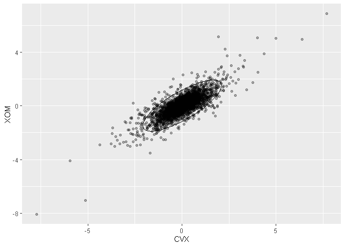
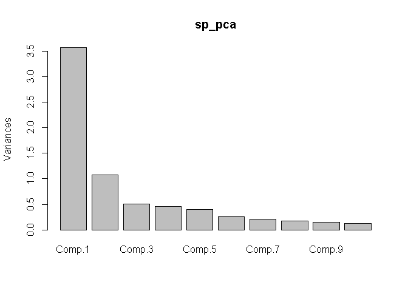
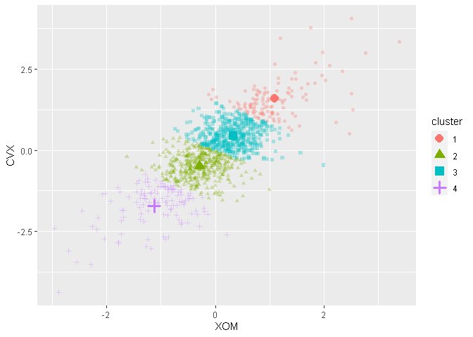
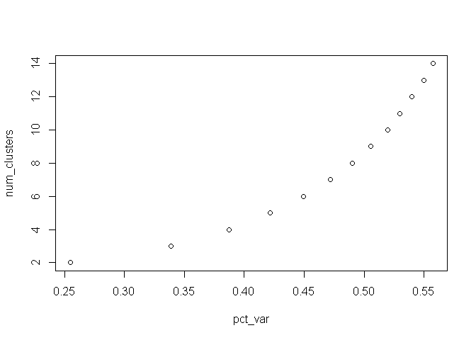
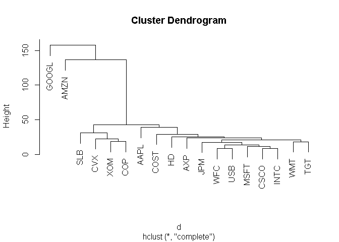
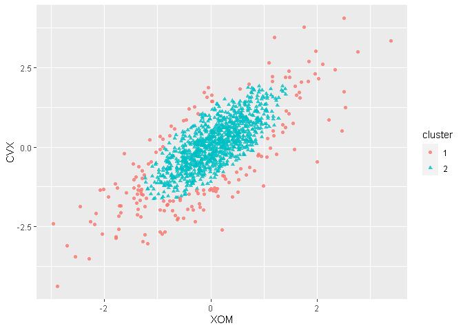
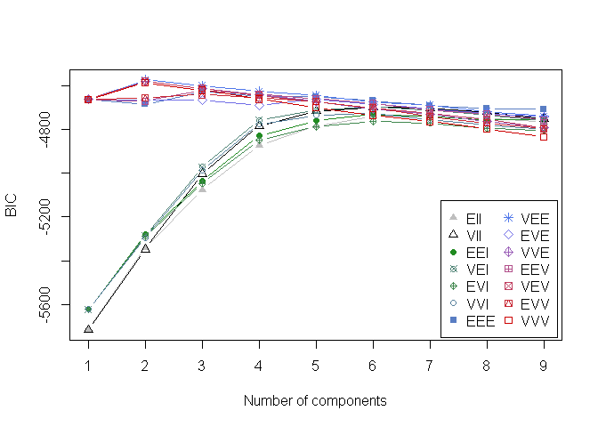
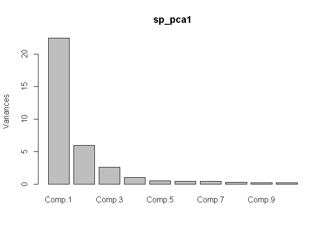

데이터과학을 위한 통계 7장
================

# 기초설정

``` r
library(tidyverse)
```

    ## -- Attaching packages --------------------------------------- tidyverse 1.3.0 --

    ## √ ggplot2 3.3.2     √ purrr   0.3.4
    ## √ tibble  3.0.4     √ dplyr   1.0.2
    ## √ tidyr   1.1.2     √ stringr 1.4.0
    ## √ readr   1.4.0     √ forcats 0.5.0

    ## -- Conflicts ------------------------------------------ tidyverse_conflicts() --
    ## x dplyr::filter() masks stats::filter()
    ## x dplyr::lag()    masks stats::lag()

비지도 학습은, 레이블이 달린 데이터를 이용해 모델을 학습하는 과정없이 데이터로부터 의미를 이끌어내는 통계적 기법들을 의미한다.

  - 클러스터링 : 데이터의 의미 있는 그룹들을 찾기
  - 차원 줄이기 : 데이터 변수들을 관리할 수 있을 만한 수준으로 줄이기

등의 다양한 용도로 사용될 수 있다.

## 1\. 주성분분석(PCA)

수치형 변수가 어떤 식으로 공변하는지 알아내는 기법.

``` r
sp500 <- read_csv(file = "C:\\Users\\rkdal\\OneDrive\\바탕 화면\\월간R프로젝트\\데이터과학을위한통계\\psds_data\\sp500_data.csv")
```

    ## Warning: Missing column names filled in: 'X1' [1]

    ## 
    ## -- Column specification --------------------------------------------------------
    ## cols(
    ##   .default = col_double(),
    ##   X1 = col_date(format = "")
    ## )
    ## i Use `spec()` for the full column specifications.

``` r
oil_px <- sp500[, c("CVX", "XOM")]
pca <- princomp(oil_px)

pca$loadings
```

    ## 
    ## Loadings:
    ##     Comp.1 Comp.2
    ## CVX  0.747  0.665
    ## XOM  0.665 -0.747
    ## 
    ##                Comp.1 Comp.2
    ## SS loadings       1.0    1.0
    ## Proportion Var    0.5    0.5
    ## Cumulative Var    0.5    1.0

``` r
ggplot(data = oil_px, aes(x=CVX, y=XOM)) +
  geom_point(alpha=.3) +
  stat_ellipse(type = "norm", level = .99)
```

<!-- -->

변수를 3개 이상으로 확장하는 것도 간단하다. 첫 성분의 선형 결합 수식에 그냥 예측변수를 추가하기만 하면 된다.

#### 주성분 해석

주성분의 상대적 중요도를 표시해주는 스크리그래프를 통해 시각화할 수 있다.

``` r
syms <- c("AAPL", "MSFT", "CSCO", "INTC", "CVX", "XOM", "SLB", "JPM", "WFC", "USB", "AXP", "WMT", "TGT", "HD", "COST")

top_sp <- sp500[sp500$X1>="2005-01-01", syms]

sp_pca <- princomp(top_sp)

screeplot(sp_pca)
```

<!-- -->

``` r
head(sp_pca$scores)
```

    ##          Comp.1     Comp.2      Comp.3      Comp.4      Comp.5      Comp.6
    ## [1,] -1.9095719  0.3052943  0.30323515  0.03050236  0.23721582 -0.32069651
    ## [2,] -1.4596924 -0.8079134  0.17619008 -0.19288302  0.59207905  0.03461476
    ## [3,] -0.2375170 -0.3132169  0.02583657  0.10866483  0.02194034 -0.09014051
    ## [4,]  0.2046122 -1.5087469 -0.27567530 -0.53971858  0.83170657 -0.49640581
    ## [5,] -0.7678893  0.3042669  0.01523711  0.40898678  0.11115821  0.39890744
    ## [6,]  0.3140638  0.3240653 -0.05637596  0.08630963 -0.21062782  0.34888238
    ##          Comp.7      Comp.8      Comp.9     Comp.10     Comp.11     Comp.12
    ## [1,]  0.1239004 -0.41934774  0.09877504  0.16244135  0.06984600 -0.03433894
    ## [2,]  0.2814870  0.02877849 -0.11603464 -0.01768958  0.40116056 -0.06385112
    ## [3,]  0.3861452  0.16413905 -0.29706059  0.03834526  0.02260347 -0.14486144
    ## [4,]  0.1354076 -0.24434650  0.26559166 -0.56717662  0.12761791 -0.03322670
    ## [5,]  0.2217765  0.20586279  0.02912307  0.09649841  0.02791394  0.06844908
    ## [6,] -0.2046373 -0.10158952 -0.12327133  0.24928995 -0.05143315 -0.06018575
    ##           Comp.13      Comp.14     Comp.15
    ## [1,]  0.016466808  0.201067531 -0.25695169
    ## [2,]  0.009857275  0.559407347  0.22778288
    ## [3,]  0.085409519 -0.078960969 -0.10607244
    ## [4,] -0.088512596 -0.133445347 -0.17931459
    ## [5,] -0.159877114  0.008671081  0.16775763
    ## [6,]  0.025293288  0.107081788 -0.05818753

첫 번째 주성분의 변동이 가장 크고 나머지 상위 주성분일수록 중요한 것을 볼 수 있다.

## 2\. K 평균 클러스터링

클러스터링(군집화)은 데이터를 서로 다른 그룹으로 분류하는 기술을 말한다.

그룹들은 예측변수 혹은 결과변수로 사용할 수 있다.

K 평균은 데이터를 K개의 클러스터로 나눈다. 할당된 클러스터의 평균과 포함된 데이터들의 거리 제곱합이 최소가 되도록 나눈다.

이 방법을 수행할 때에는 데이터를 정규화해두는 것이 좋다. 정규화를 하지 않으면 스케일이 가장 큰 변수가 클러스터링 과정을
독점한다.

**정규화** : 데이터 값에서 평균을 빼고 표준편차로 나누어주는 방법

``` r
df <- sp500[sp500$X1 >="2011-01-01", c("XOM", "CVX")]

# K 평균 클러스터링 수행
km <- kmeans(df, centers = 4)

# 클러스터열 추가
df$cluster <- factor(km$cluster)

head(df)
```

    ## # A tibble: 6 x 3
    ##      XOM    CVX cluster
    ##    <dbl>  <dbl> <fct>  
    ## 1 0.737   0.241 3      
    ## 2 0.169  -0.585 2      
    ## 3 0.0266  0.447 3      
    ## 4 0.249  -0.920 2      
    ## 5 0.337   0.181 3      
    ## 6 0      -0.464 2

``` r
# 클러스터 평균 확인
centers <- data.frame(cluster=factor(1:4), km$centers)

centers
```

    ##   cluster        XOM        CVX
    ## 1       1  1.0920721  1.5810766
    ## 2       2 -0.2864216 -0.4929646
    ## 3       3  0.3258460  0.4499705
    ## 4       4 -1.1230447 -1.7188447

``` r
# 클러스터 평균을 포함하여 시각화하기
ggplot(data=df, aes(x=XOM, y=CVX, color=cluster, shape=cluster)) +
  geom_point(alpha=.3) +
  geom_point(data=centers, aes(x=XOM, y=CVX), size=3, stroke=2)
```

<!-- -->

k 평균 알고리즘은 사용자가 미리 정해준 K값과 클러스터 평균의 초깃값을 가지고 알고리즘을 시작한다.

  - 각 레코드를 거리가 가장 가까운 평균을 갖는 클러스터에 할당한다.
  - 새로 할당된 레코드들을 가지고 새로운 클러스터 평균을 계산한다.

해당 알고리즘에서는 보통 각 레코드의 K개의 클러스터들 가운데 하나에 랜덤하게 할당한 후 그렇게 얻은 클러스터들의 평균을
사용한다.

랜덤하게 초깃값을 변화시켜가며 해를 구할 수도 있다. nstar 변수를 이용해 랜덤하게 초깃값을 다르게 설정해 알고리즘을 시행할
횟수를 설정할 수 있다.

``` r
# 초깃값을 다르게 설정하여 10회 수행
syms <- c("AAPL", "MSFT", "CSCO", "INTC", "CVX", "XOM", "SLB", "JPM", "WFC", "USB", "AXP", "WMT", "TGT", "HD", "COST")

df <- sp500[sp500$X1 >="2011-01-01", syms]

km <- kmeans(df, centers = 5, nstart=10)

# 각 클러스터들의 크기
km$size
```

    ## [1] 180 253 301 100 297

#### 클러스터 개수 선정

적용되는 문제에 따라서 적절한 개수를 지정해줘야 한다. 통계적 접근 방식도 사용할 수 있다.

팔꿈치 방법은 언제 클러스터 세트가 데이터의 분산의 “대부분”을 설명하는지를 알려준다. 누적 분산이 가파르게 상승한 다음 어느
순간 평평하게 되는 지점을 말하며 이러한 성질 때문에 팔꿈치라는 이름이 붙었다.

``` r
pct_var <- data.frame(pct_var = 0,
                      num_clusters = 2:14)

totalss <- kmeans(df,
                  centers = 14,
                  nstart = 50,
                  iter.max = 100)$totss

for (i in 2:14) {
  
  pct_var[i-1, "pct_var"] <- kmeans(df, centers=i, nstart = 50, iter.max = 100)$betweenss/totalss
  
}

pct_var
```

    ##      pct_var num_clusters
    ## 1  0.2547681            2
    ## 2  0.3386523            3
    ## 3  0.3875530            4
    ## 4  0.4218161            5
    ## 5  0.4493862            6
    ## 6  0.4718905            7
    ## 7  0.4900672            8
    ## 8  0.5056459            9
    ## 9  0.5193972           10
    ## 10 0.5296330           11
    ## 11 0.5397553           12
    ## 12 0.5496254           13
    ## 13 0.5573339           14

``` r
plot(pct_var)
```

<!-- -->

해당 예제에서는 분산이 증가율이 너무 서서히 떨어지기 때문에 눈에 띄는 위치가 없는 경우이다.

일반적으로 클러스터의 개수를 정확히 얻는 방법은 없다. 교차타당성검사 등을 동원하여 결정하는 것이 바람직하다.

## 3\. 계층적 클러스터링

K 평균 알고리즘을 사용하는 것보다 유연하고, 수치형 변수가 아니어도 쉽게 적용이 가능하다. 특잇점이나 비정상적인 그룹이나
레코드를 발견하는 데 더 민감하다.

계층적 클러스터링은 아래의 2가지를 기본 요소로 한다.

  - 두 개의 레코드 i와 j사이의 거리를 측정하기 위한 거리 측정 지표
  - 두 개의 클러스터 A와 B 사이의 차이를 측정하기 위한, 각 클러스터 구성원 간의 거리를 기반으로 한 비유사도 측정 지표

계층적 클러스터링은 각 레코드 자체를 개별 클러스터로 설정하여 시작하고, 가장 가까운 클러스터를 결합해나가는 작업을 반복한다.

R에서 hclust 함수를 사용하여 계층적 클러스터링을 수행할 수 있다.

``` r
syms <- c("GOOGL", "AMZN", "AAPL", "MSFT", "CSCO", "INTC", "CVX", "XOM", "SLB", "COP", "JPM", "WFC", "USB", "AXP", "WMT", "TGT", "HD", "COST")

# 행이 주가가 되도록 전치
df <- sp500
df_row <- df$X1
df$X1 <- NULL
row.names(df) <- df_row
```

    ## Warning: Setting row names on a tibble is deprecated.

``` r
df <- t(df[row.names(df) >= "2011-01-01", syms])

# dist 함수를 이용하여 주가 간 거리 계산
d <- dist(df)

hcl <- hclust(d)

# 덴드로그램
plot(hcl)
```

<!-- -->

클러스터링 알고리즘은 데이터 프레임의 레코드(행)들을 클러스터링한다. 수익이 유사한 기업들을 서로 묶는 것이 목적이므로 데이터
프레임을 전치해서 행을 따라 기업별 주가 정보가 오게 하고 열을 따라 날짜가 오도록 해야 한다.

여기서 cutree 함수를 사용하여 원하는 클러스터의 수를 추출할 수 있다.

``` r
cutree(hcl, k=4)
```

    ## GOOGL  AMZN  AAPL  MSFT  CSCO  INTC   CVX   XOM   SLB   COP   JPM   WFC   USB 
    ##     1     2     3     3     3     3     4     4     4     4     3     3     3 
    ##   AXP   WMT   TGT    HD  COST 
    ##     3     3     3     3     3

#### 병합 알고리즘

계층적 클러스터링에서 가장 중요한 역할을 하는 것은 병합 알고리즘이다. 단일 레코드 클러스터부터 시작하여 점점 더 큰 클러스터들을
만든다.

  - 데이터 모든 레코드에 대해, 단일 레코드로 구성된 클러스터들로 초기 클러스터 집합을 만든다.
  - 모든 쌍의 클러스터 k, l사이의 비유사도를 계산한다.
  - 비유사도에 따라 가장 가까운 두 클러스터를 병합한다.
  - 둘 이상의 클러스터가 남아 있다면 2단계로 돌아간다.

비유사도 측정 지표로는 완전연결, 단일연결, 평균연결, 최소분산이 있다. 최소분산의 경우 K 평균 알고리즘과 유사하다.

## 4\. 모델 기반 클러스터링

계층적 클러스터링과 K 평균 클러스터링 방법은 모두 확률모형에 기반한 것이 아닌, 휴리스틱한 방법이다.

모델 기반 클러스터링은 통계 이론에 기초하는 기법이다. 클러스터의 성질과 수를 결정하는 더 엄격한 방법을 제공한다.

가장 널리 사용되는 모델 기반 클러스터링 방법은 다변량정규분포를 따른다.

``` r
library(mclust)
```

    ## Package 'mclust' version 5.4.7
    ## Type 'citation("mclust")' for citing this R package in publications.

    ## 
    ## Attaching package: 'mclust'

    ## The following object is masked from 'package:purrr':
    ## 
    ##     map

``` r
df <- sp500
df_row <- df$X1
df$X1 <- NULL
row.names(df) <- df_row
```

    ## Warning: Setting row names on a tibble is deprecated.

``` r
df <- df[row.names(df)>="2011-01-01", c("XOM", "CVX")]

mcl <- Mclust(df)

summary(mcl)
```

    ## ---------------------------------------------------- 
    ## Gaussian finite mixture model fitted by EM algorithm 
    ## ---------------------------------------------------- 
    ## 
    ## Mclust VEE (ellipsoidal, equal shape and orientation) model with 2 components: 
    ## 
    ##  log-likelihood    n df       BIC       ICL
    ##       -2255.125 1131  9 -4573.528 -5075.657
    ## 
    ## Clustering table:
    ##   1   2 
    ## 168 963

predict 함수를 사용하여 할당된 클러스터 정보를 얻을 수 있다.

``` r
cluster <- factor(predict(mcl)$classification)

ggplot(data = df, aes(x = XOM, y = CVX, color = cluster, shape = cluster)) +
  geom_point(alpha = .8)
```

<!-- -->

summary 함수를 사용하여 각 정규분포의 파라미터를 추출할 수 있다.

``` r
summary(mcl, parameters = TRUE)$mean
```

    ##            [,1]       [,2]
    ## XOM -0.04362218 0.05792282
    ## CVX -0.21109525 0.07375447

``` r
summary(mcl, parameters = TRUE)$variance
```

    ## , , 1
    ## 
    ##          XOM      CVX
    ## XOM 1.044671 1.065190
    ## CVX 1.065190 1.912748
    ## 
    ## , , 2
    ## 
    ##           XOM       CVX
    ## XOM 0.2998935 0.3057838
    ## CVX 0.3057838 0.5490920

모델 기반 클러스터링의 목적은 사실 데이터를 가장 잘 설명하는 다변량정규분포를 찾는 것이다.

mclust는 클러스터 수를 자동으로 선택한다. **베이즈 정보기준(BIC)** 값이 가장 큰 클러스터의 개수를 선택하도록
동작하기 때문이다.

``` r
plot(mcl, what="BIC", ask=FALSE)
```

<!-- -->

모델 기반 클러스터링 기술에는, 기본적으로 데이터들이 모델을 따른다는 가정이 필요하며, 클러스터링 결과가 이 가정에 따라 매우
다르다.

또한, 계산량이 많기 때문에 확장성이 매우 낮다. 여러모로 제약이 따르는 클러스터링이라고 할 수 있다.

## 5\. 스케일링과 범주형 변수

  - 스케일링 : 데이터의 범위를 늘리거나 줄이는 방식으로 여러 변수들이 같은 스케일에 오도록 하는 것.
  - 정규화 : 원래 변수 값에서 평균을 뺀 후에 표준편차로 나누는 방법(스케일링의 일종이자, 표준화)
  - 고워 거리 : 수치형과 범주형 데이터가 섞에 있는 경우에 모든 변수가 0\~1사이에 오도록 하는 스케일링 방법

#### 지배변수

변수들이 서로 동일한 규모로 측정되고 상대적 중요성을 정확하게 반영하는 경우, 변수의 스케일 재조정이 유용할 수 있다.

``` r
top_sp1 <- sp500[sp500$X1 >= "2005-01-01", syms]

sp_pca1 <- princomp(top_sp1)

screeplot(sp_pca1)
```

<!-- -->

``` r
sp_pca1$loadings[, 1:2]
```

    ##           Comp.1       Comp.2
    ## GOOGL 0.85731020  0.477873106
    ## AMZN  0.44472787 -0.874148994
    ## AAPL  0.07162733 -0.020802166
    ## MSFT  0.03600178 -0.006203843
    ## CSCO  0.02920488 -0.003045316
    ## INTC  0.02666615 -0.006069073
    ## CVX   0.08954806 -0.037420102
    ## XOM   0.08033584 -0.020511397
    ## SLB   0.11021794 -0.030356046
    ## COP   0.05773852 -0.024117246
    ## JPM   0.07122842 -0.009244181
    ## WFC   0.05322838 -0.008596597
    ## USB   0.04166969 -0.005952004
    ## AXP   0.07890655 -0.024027330
    ## WMT   0.04034602 -0.007141310
    ## TGT   0.06365943 -0.024662454
    ## HD    0.05141244 -0.032921951
    ## COST  0.07140288 -0.033826142

위의 주성분분석을 본다면, GOOGL과 AMZN가 전체 부하량을 지배한다는 것을 알 수 있다.

이러한 지배 변수를 전체 분석에서 제외하고 별도로 스케일링, 제거 처리할 수 있다.

의미 있는 데이터 축소를 보장하기 위해서는 데이터의 스케일 조정이 필요하다는 것을 기억하자.
